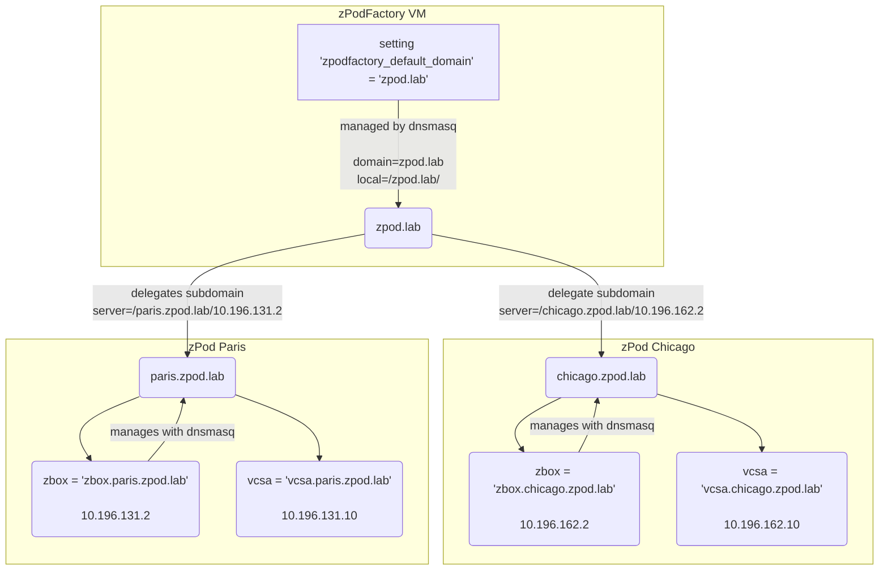
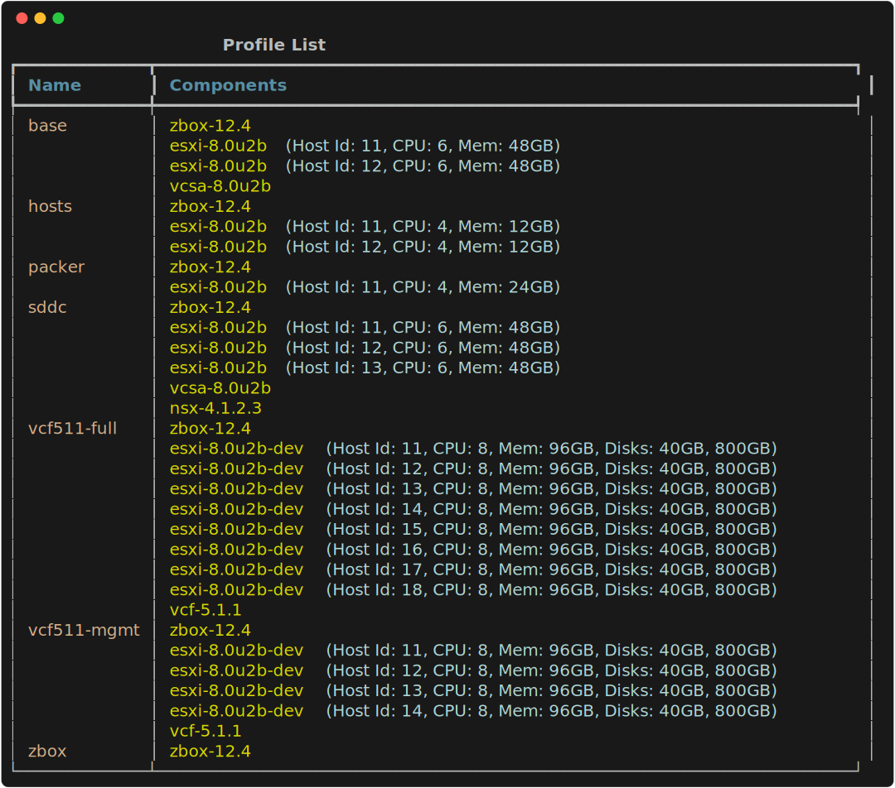

# FAQ

Frequently asked questions.

## How is DNS configured and how does it work ?

DNS is a hierarchical system that resolves names to IP addresses. In zPodFactory the main domain is set using the `zpodfactory_default_domain` variable

This domain is used to configure the DNS server running on the zPodFactory VM. The DNS server is configured to resolve all domain set by the `zpodfactory_default_domain` to the IP address of the zPodFactory VM

Then for **EACH** zPod deployed, they get their own unique subdomain

The subdomain is composed of the zPod name and the `zpodfactory_default_domain`

For example, if the `zpodfactory_default_domain` is set to `zpodfactory.local` and the zPod name is `zpod-a`, then the subdomain will be `zpod-a.zpodfactory.local`.

!!! warning
    This means every zPod has a unique name, as it's used to generate the subdomain. If you try to deploy a zPod with the same name as an existing one, the deployment will fail

Quick representation on how it works:

- The `zpodfactory_default_domain` is set to `zpod.lab` in this example, and is hosted by the zPodFactory VM.
    - the local dnsmasq service is configured to resolve `zpod.lab`
    - the subdomain `chicago.zpod.lab` is delegated to the zPod Chicago  `zbox`
    - the subdomain `paris.zpod.lab` is delegated to the zPod Paris `zbox`

- The zPod Chicago is deployed with the name `chicago`
    - The local dnsmasq service on the chicago `zbox` is configured to resolve all names ending with `chicago.zpod.lab`

- The zPod Paris is deployed with the name `paris`
    - The local dnsmasq service on the paris  `zbox` is configured to resolve all names ending with `paris.zpod.lab`



This also means any zPod Admin owns his subdomain and can add some DNS entries to their local zPod DNS server.

For example let's say I'm the admin of the Paris zPod and I want to add the `demo.paris.zpod.lab` A record to point to following IP `192.168.131.100`

Login to the `zbox.paris.zpod.lab` VM using the Paris zPod Password and run edit the following file `/etc/hosts` to add your demo entry (by default the dnsmasq configuration reads this file and advertises it's content as DNS records):

Check the current `reserved` static entries:

``` { data-copy="cat /etc/hosts" }
❯ cat /etc/hosts
127.0.0.1       localhost
10.196.131.2     zbox.paris.zpod.lab    zbox
10.196.131.3     usagemeter

10.196.131.9     nsxv
10.196.131.10    vcsa

10.196.131.11    esxi11
10.196.131.12    esxi12
10.196.131.13    esxi13
10.196.131.14    esxi14
10.196.131.15    esxi15
10.196.131.16    esxi16
10.196.131.17    esxi17
10.196.131.18    esxi18

10.196.131.20    nsx nsxt
10.196.131.21    nsx21
10.196.131.22    nsx22
10.196.131.23    nsx23

10.196.131.25    cloudbuilder vcf
10.196.131.26    sddcmgr

10.196.131.29    vrlcm
10.196.131.30    vrops
10.196.131.31    vrli log
10.196.131.36    vrni
10.196.131.37    vrni-proxy

10.196.131.40    vcd cloud
10.196.131.41    vcda

10.196.131.45    hcx
10.196.131.46    hcx-cgw
10.196.131.47    hcx-l2c

#
# 50-60 DHCP Range
#

10.196.131.62    vyos

# VLAN 192 (NSX - Edge Cluster / Edge Nodes)
10.196.131.250   edgecluster-vip
10.196.131.251   edgenode251
10.196.131.252   edgenode252
```

!!! warning
    **DO NOT REMOVE** the pre-configured entries, they are used for all `components` deployments. (unless you know exactly what you are doing)

    Adding new entries is fine, but removing existing ones is not.

Add the new entry:

```
192.168.131.100    demo
```

Save and exit, and reload the dnsmasq service.

``` { data-copy="systemctl reload dnsmasq" }
❯ systemctl reload dnsmasq
```

!!! info

    Since zPodFactory version 0.7.2, the latest zbox-12.5 component has a zBox DNS API endpoint implemented, which will be automatically leveraged when using profiles and specific components, and you can also add your A records directly from the zPodFactory CLI, check the CLI help:

    ``` { data-copy="zcli zpod dns add --help" }
    ❯ zcli zpod dns add --help
    ```


## How does the embedded download engine work ?

!!! warning

    **Since April 2024**

    The download engine is not working for VMware products anymore since Broadcom terminated the customer connect VMware website.
    It will still work for non VMware products, such as zbox download, etc.

    To workaround the issue, we have built an embedded `component upload` feature that allows you to upload your own OVA files to the framework using the `zcli` command.

    By checking the file checksum, it will be able to cross-check automatically from all supported components and will enable the appropriate component.

    Check [Manage components](../guide/admin/index.md#manage-components) section


The download engine has been designed to be as simple as possible for the end user. That said it does have some very specific requirements to work properly.

It relies on a [VMware Customer Connect](https://customerconnect.vmware.com/home) account that needs to be entitled to the products you want to leverage for your nested labs. (If you are not entitled to a product you try to enable/download it will fail)

The download engine is only aware about the products available in the `library`. The library is hosted here:

- [https://github.com/zPodFactory/zPodLibrary](https://github.com/zPodFactory/zPodLibrary)

The default library is a simple collection of JSON files that contains the metadata of all products/versions available for download.

The download engine is then wrapping the [VMware Customer Connect CLI](https://github.com/vmware-labs/vmware-customer-connect-cli) with the `library` metadata for a given `component` to launch the correct download and verify its integrity, then extract it to the correct location on the zPodFactory VM.

!!! info
    Please refer to the following related sections for setting up the download engine correctly and use it:

    Check [Manage settings](../guide/admin/index.md#manage-settings) to setup the customer connect credentials

    Check [Manage library](../guide/admin/index.md#manage-library) for managing the library

    Check [Manage components](../guide/admin/index.md#manage-components) for managing the components

## How to configure product licenses ?

Right now only VMware vCenter licenses are added to a deployed zPod, we hope to add more products in the future. (NSX will be the next one to be supported)

!!! info
    Please refer to the following related sections for setting up the download engine correctly and use it:

    Check [Manage settings](../guide/admin/index.md#manage-settings) and check the `license_<component>-<version>` variables in the provided screenshot.

## How to access the Prefect Flow engine UI ?

For a visual view of everything executed/launched by the zPodFactory flow engine, you can access the Prefect Flow engine UI here:

- http://zpodfactory.domain.lab:8060

## How to troubleshoot something ?

There are 2 mains ways to troubleshoot something in zPodFactory:

- Docker Compose logs
- The Prefect Flow engine UI

### Docker Compose logs

Change to zPodFactory Project directory:

``` { data-copy="cd ~/git/zpodcore" }
❯ cd ~/git/zpodcore
```

Check the logs:

``` { data-copy="docker-compose logs -f" }
❯ docker-compose logs -f
```

### The Prefect Flow engine UI

- https://manager.zpodfactory.domain:8360 (TBD)


## How to update the project ?

TBD (will likely be git based with a provided update command)

## How to add a new profile ?

Profiles can be created by an admin user, using the zPod API directly or the zPod CLI (`zcli`)

Prepare a `profile.json` file with the content of the `profile`, here is an example.

!!! info

    `zbox` component and `esxi` components are mandatory, all other components are optional.

    To find which components are available, check the `zcli component list` command, or check the zPodFactory [library](https://github.com/zPodFactory/zPodLibrary).

    Usually you want at least a `zbox`, a few `esxi` hosts and a `vcsa` or `vcf` as the base profile for any work/testing.

``` json
[
    {
      "component_uid": "zbox-12.7"
    },
    [
      {
        "component_uid": "esxi-8.0u3c",
        "host_id": 11,
        "hostname": "esxi11",
        "vcpu": 8,
        "vmem": 64
      },
      {
        "component_uid": "esxi-8.0u3c",
        "host_id": 12,
        "hostname": "esxi12",
        "vcpu": 8,
        "vmem": 64
      },
      {
        "component_uid": "esxi-8.0u3c",
        "host_id": 13,
        "hostname": "esxi13",
        "vcpu": 8,
        "vmem": 64
      },
      {
        "component_uid": "esxi-8.0u3c",
        "host_id": 14,
        "hostname": "esxi14",
        "vcpu": 8,
        "vmem": 64
      }
    ],
    {
        "component_uid": "vcsa-8.0u3d"
    },
    {
        "component_uid": "vcd-10.6.1"
    },
    {
        "component_uid": "nsx-4.2.1.3"
    }
]
```

Next use zcli to create the profile:

``` { data-copy="zcli profile create sddc-vcd -pf profile.json" }
❯ zcli profile create sddc-vcd -pf profile.json
Profile sddc-vcd has been created.
```

Check the profiles list:

``` { data-copy="zcli profile list" }
❯ zcli profile list
```



## Why does preparing NSX hosts break my zPod ?

The DLR feature in NSX will setup a very specific/hardcoded mac address `02:50:56:56:44:52` for the DLR interface. This mac address is also configured in *any new NSX host preparation step* by the nested environment, which makes any L3 forwarding impossible with the physical environment and creates a routing network blackhole between the physical environment and nested ESXi hosts.

It will seem as if your zPod went down (vcsa,nsx,esxi unresponsive from routed networks).

That said if you try to ping/connect/access the zbox vm of that zPod, it will have no networking issues as it isn't hosted by one of the nested zPod ESXi hosts.

You will need to change this hardcoded mac address to a different one, as it will conflict with any new nested environment when prepared by NSX.

You can also fix a broken zPod with the same steps from the zbox VM as L2 connectivity will work properly:

- [Change the MAC Address of NSX Virtual Distributed Router](https://techdocs.broadcom.com/us/en/vmware-cis/nsx/vmware-nsx/4-2/migration-guide/preparing-layer-2-bridging-for-lift-and-shift-migration/change-the-mac-address-of-nsx-t-virtual-distributed-router.html)

!!! info

    We recommend that you apply this new mac address to the physical environment layer, so that all new nested labs will be ready to go with no extra steps.


## Why does creating a vSAN datastore fails in my zPod ?

If you are trying to setup/run nested vSAN over a physical vSAN, you might encounter some issues with the vSAN datastore creation.

You will need to enable the `FakeSCSIReservations` setting on each host part of your physical vSphere vSAN cluster.

Leverage `esxcli` on *every* vSAN physical host:

``` { .sh data-copy="esxcli system settings advanced set -o /VSAN/FakeSCSIReservations -i 1" }
❯ esxcli system settings advanced set -o /VSAN/FakeSCSIReservations -i 1
```

[William Lam](https://twitter.com/lamw) explains the issue and the workaround in one of his blog articles:

- [How to run Nested ESXi on top of a VSAN datastore?](https://williamlam.com/2013/11/how-to-run-nested-esxi-on-top-of-vsan.html)
- [PowerCLI Script](https://developer.vmware.com/samples/5388/set-fakescsi-reservations-on-vsan-to-allow-nested-esxi-vms-to-run-vsan) to set the FakeSCSIReservations on all hosts in a vSAN cluster


## How to add a new product ?

TBD

## Why is x product not available through the download engine ?

There can be multiple reasons for that:

- We just haven't added it yet (time)
    - This could also be because we are missing automation bits around it
    - This could also be because our download engine tooling can't fetch the product from VMware Customer Connect (there are some caveats on some specific Product sections)
- The product is not available on VMware Customer Connect (For example, Pivotal products).

!!! info

    Let us know which products you would like to be supported by zPodFactory and the download engine, and if you can provide any automation bits around it, that would be awesome.

## How to configure the Appliance WireGuard for external access ?

The zPodFactory Appliance will have a docker container ready to be used as a WireGuard VPN server. This will allow you to connect to your zPodFactory Appliance and networks from anywhere in the world.

We are leveraging this simple and efficient WireGuard container:

- [https://github.com/wg-easy/wg-easy](https://github.com/wg-easy/wg-easy)

This might change in the future, but for now it has been quite good for us with pretty large teams (80+ VPN accounts accessing the nested labs)

## How to get help ?

- For now probably just create [GitHub Issues](https://github.com/zPodFactory/zpodcore/issues), and add as much information as you can.
- We will likely add a Slack/Discord channel for discussions in the future.
