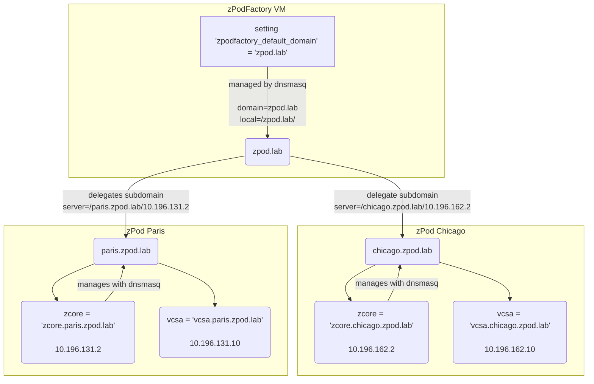

# FAQ

Frequently asked questions.

## How is DNS configured and how does it work ?

DNS is a hierarchical system that resolves names to IP addresses. In zPodFactory the main domain is set using the `zpodfactory_default_domain` variable

This domain is used to configure the DNS server running on the zPodFactory VM. The DNS server is configured to resolve all domain set by the `zpodfactory_default_domain` to the IP address of the zPodFactory VM

Then for **EACH** zPod deployed, they get their own unique subdomain

The subdomain is composed of the zPod name and the `zpodfactory_default_domain`

For example, if the `zpodfactory_default_domain` is set to `zpodfactory.local` and the zPod name is `zpod-a`, then the subdomain will be `zpod-a.zpodfactory.local`.

!!! warning
    This means every zPod has a unique name, as it's used to generate the subdomain. If you try to deploy a zPod with the same name as an existing one, the deployment will fail

Quick representation on how it works:

- The `zpodfactory_default_domain` is set to `zpod.lab` in this example, and is hosted by the zPodFactory VM.
    - the local dnsmasq service is configured to resolve `zpod.lab`
- The subdomain `chicago.zpod.lab` is delegated to the zPod Chicago **`zcore`** (legacy zPods may use `zbox`)
    - the subdomain `paris.zpod.lab` is delegated to the zPod Paris **`zcore`**

- The zPod Chicago is deployed with the name `chicago`
    - The local dnsmasq service on the chicago **`zcore`** is configured to resolve all names ending with `chicago.zpod.lab`

- The zPod Paris is deployed with the name `paris`
    - The local dnsmasq service on the paris **`zcore`** is configured to resolve all names ending with `paris.zpod.lab`


``` mermaid

graph TD

    subgraph zpodfactory["zPodFactory VM"]
        setting["setting 'zpodfactory_default_domain' = 'zpod.lab'"]
        global_domain("zpod.lab")

        setting -- "managed by dnsmasq\n\ndomain=zpod.lab\nlocal=/zpod.lab/" --> global_domain

    end

    subgraph zpod_chicago["zPod Chicago"]
        zpod_chicago_domain("chicago.zpod.lab");


        zpod_chicago_zbox("zcore = 'zcore.chicago.zpod.lab'\n\n10.196.162.2");
        zpod_chicago_vcenter("vcsa = 'vcsa.chicago.zpod.lab'\n\n10.196.162.10");

        zpod_chicago_domain --> zpod_chicago_zbox
        zpod_chicago_zbox -- manages with dnsmasq --> zpod_chicago_domain
        zpod_chicago_domain --> zpod_chicago_vcenter
    end

    subgraph zpod_paris["zPod Paris"]
        zpod_paris_domain("paris.zpod.lab");


        zpod_paris_zbox("zcore = 'zcore.paris.zpod.lab'\n\n10.196.131.2");
        zpod_paris_vcenter("vcsa = 'vcsa.paris.zpod.lab'\n\n10.196.131.10");
        zpod_paris_domain --> zpod_paris_zbox
        zpod_paris_zbox -- manages with dnsmasq --> zpod_paris_domain
        zpod_paris_domain --> zpod_paris_vcenter
    end


    global_domain -- "delegate subdomain\nserver=/chicago.zpod.lab/10.196.162.2" --> zpod_chicago_domain
    global_domain -- "delegates subdomain\nserver=/paris.zpod.lab/10.196.131.2" --> zpod_paris_domain
```

This also means any zPod Admin owns his subdomain and can add DNS entries on that zPod's local DNS server.

Since **`zcore-13.5`**, component hostnames are **added automatically** when zPodFactory deploys or adds components. The zPod Engine calls the core appliance's **`zboxapi` `/dns` API**, which writes records into `/etc/hosts` and reloads dnsmasq — you no longer maintain a large static `/etc/hosts` template on the core VM. A fresh `zcore` image only seeds `localhost` and the core hostname itself; everything else appears as components come up.

!!! warning
    **Do not modify DNS records for components deployed by zPodFactory.** Those entries (`zcore`, ESXi hosts, vCenter, NSX, and so on) are maintained by the engine and relied on across the whole stack. Changing or deleting them can break deploy follow-up steps, config scripts, and day-two operations for the entire zPod. Add or edit DNS only for **your own** extra hostnames — not for platform-managed components.

List what is registered today:

``` { data-copy="zcli zpod dns list paris" }
❯ zcli zpod dns list paris
```

See [Manage DNS records](../guide/user/index.md#manage-dns-records) for the full CLI reference and screenshots.

### Example: add a custom record

Say you admin the Paris zPod and want `demo.paris.zpod.lab` → `192.168.131.100` (for example an overlay or guest subnet not tied to a component deploy):

``` { data-copy="zcli zpod dns add paris --hostname demo --ip 192.168.131.100" }
❯ zcli zpod dns add paris --hostname demo --ip 192.168.131.100
```

Use `--host-id` instead of `--ip` when the name should live on the zPod management subnet (host id maps to `.x` in the `/26`).

Update or remove entries the same way:

```bash
zcli zpod dns update paris --hostname demo --ip 192.168.131.101
zcli zpod dns remove paris --hostname demo --ip 192.168.131.100
```

!!! info
    Legacy **`zbox`** appliances from older images may still show a long pre-seeded `/etc/hosts` with reserved component names. That workflow is obsolete on current **`zcore-*`** cores — prefer **`zcli zpod dns add/update/remove`** (or the API) rather than SSH and manual edits. dnsmasq on the core still reads `/etc/hosts`; the difference is that zPodFactory populates it for you.


## How does the embedded download engine work ?

The download engine fetches component binaries defined in the [zPodLibrary](https://github.com/zPodFactory/zPodLibrary). See the dedicated [Broadcom download token](../guide/admin/broadcom-download-token.md) guide for obtaining and configuring the token, troubleshooting 401/403 errors, and testing downloads.

### Quick reference

VMware product URLs use the Broadcom offline depot layout:

```
https://dl.broadcom.com/${BROADCOM_DOWNLOAD_TOKEN}/PROD/COMP/<TYPE>/<filename>
```

Configure your token:

```bash
zcli setting update zpodfactory_broadcom_download_token --value YOUR_TOKEN
```

Only the **`https`** download engine is supported. Use `zcli component upload` as a fallback when depot download is not available.

Check [Manage settings](../guide/admin/index.md#manage-settings) and [Manage components](../guide/admin/index.md#manage-components) for the full workflow.

## How to configure product licenses ?

License keys are stored as `license_<component>-<version>` settings and applied automatically after component deploy. vCenter and NSX licenses are supported — configure one or more NSX license settings as needed.

Check [Manage settings](../guide/admin/index.md#manage-settings) for examples.

## How to access the Prefect Flow engine UI ?

For a visual view of background tasks executed by the zPod Engine, use the **Prefect UI**:

- `http://zpodfactory.domain.lab:8060`

For day-to-day zPodFactory administration (zPods, components, profiles, endpoints, settings), use **[zpodweb](../guide/user/web-ui.md)** on port **8500** instead — it is the primary Web UI and is deployed automatically with the appliance.

## How to troubleshoot something ?

There are 2 mains ways to troubleshoot something in zPodFactory:

- Docker Compose logs
- The Prefect Flow engine UI

### Docker Compose logs

Change to zPodFactory Project directory:

``` { data-copy="cd ~/git/zpodcore" }
❯ cd ~/git/zpodcore
```

Check the logs:

``` { data-copy="docker compose logs -f" }
❯ docker compose logs -f
```

### The Prefect Flow engine UI

- `http://zpodfactory.domain.lab:8060`

For zPodFactory administration, use [zpodweb](../guide/user/web-ui.md) on port **8500** instead.


## How to update the project ?

TBD (will likely be git based with a provided update command)

## How to add a new profile ?

Profiles can be created by an admin user, using the zPod API directly or the zPod CLI (`zcli`)

Prepare a `profile.json` file with the content of the `profile`, here is an example.

!!! info

    **`zcore-*`** component and **`esxi`** components are mandatory; all other components are optional.

    To find which components are available, check the `zcli component list` command, or check the zPodFactory [library](https://github.com/zPodFactory/zPodLibrary).

    Usually you want at least a `zcore`, a few `esxi` hosts and a `vcsa` or VCF profile as the base for any work/testing.

``` json
[
    {
      "component_uid": "zcore-13.5"
    },
    [
      {
        "component_uid": "esxi-8.0u3i",
        "host_id": 11,
        "hostname": "esxi11",
        "vcpu": 8,
        "vmem": 64
      },
      {
        "component_uid": "esxi-8.0u3i",
        "host_id": 12,
        "hostname": "esxi12",
        "vcpu": 8,
        "vmem": 64
      },
      {
        "component_uid": "esxi-8.0u3i",
        "host_id": 13,
        "hostname": "esxi13",
        "vcpu": 8,
        "vmem": 64
      },
      {
        "component_uid": "esxi-8.0u3i",
        "host_id": 14,
        "hostname": "esxi14",
        "vcpu": 8,
        "vmem": 64
      }
    ],
    {
        "component_uid": "vcsa-8.0u3i"
    },
    {
        "component_uid": "vcd-10.6.1"
    },
    {
        "component_uid": "nsx-4.2.1.3"
    }
]
```

Next use zcli to create the profile:

``` { data-copy="zcli profile create sddc-vcd -pf profile.json" }
❯ zcli profile create sddc-vcd -pf profile.json
Profile sddc-vcd has been created.
```

Check the profiles list:

``` { data-copy="zcli profile list" }
❯ zcli profile list
```


## Why does preparing NSX hosts break my zPod ?

The DLR feature in NSX will setup a very specific/hardcoded mac address `02:50:56:56:44:52` for the DLR interface. This mac address is also configured in *any new NSX host preparation step* by the nested environment, which makes any L3 forwarding impossible with the physical environment and creates a routing network blackhole between the physical environment and nested ESXi hosts.

It will seem as if your zPod went down (vcsa,nsx,esxi unresponsive from routed networks).

That said if you try to ping/connect/access the **`zcore`** VM of that zPod (legacy: `zbox`), it will have no networking issues as it isn't hosted by one of the nested zPod ESXi hosts.

You will need to change this hardcoded mac address to a different one, as it will conflict with any new nested environment when prepared by NSX.

You can also fix a broken zPod with the same steps from the core VM as L2 connectivity will work properly:

- [Change the MAC Address of NSX Virtual Distributed Router](https://techdocs.broadcom.com/us/en/vmware-cis/nsx/vmware-nsx/4-2/migration-guide/preparing-layer-2-bridging-for-lift-and-shift-migration/change-the-mac-address-of-nsx-t-virtual-distributed-router.html)

!!! info

    We recommend that you apply this new mac address to the physical environment layer, so that all new nested labs will be ready to go with no extra steps.


## Why does creating a vSAN datastore fails in my zPod ?

If you are trying to setup/run nested vSAN over a physical vSAN, you might encounter some issues with the vSAN datastore creation.

You will need to enable the `FakeSCSIReservations` setting on each host part of your physical vSphere vSAN cluster.

Leverage `esxcli` on *every* vSAN physical host:

``` { .sh data-copy="esxcli system settings advanced set -o /VSAN/FakeSCSIReservations -i 1" }
❯ esxcli system settings advanced set -o /VSAN/FakeSCSIReservations -i 1
```

[William Lam](https://twitter.com/lamw) explains the issue and the workaround in one of his blog articles:

- [How to run Nested ESXi on top of a VSAN datastore?](https://williamlam.com/2013/11/how-to-run-nested-esxi-on-top-of-vsan.html)
- [PowerCLI Script](https://developer.vmware.com/samples/5388/set-fakescsi-reservations-on-vsan-to-allow-nested-esxi-vms-to-run-vsan) to set the FakeSCSIReservations on all hosts in a vSAN cluster


## How to add a new product ?

TBD

## Why is x product not available through the download engine ?

There can be multiple reasons for that:

- We just haven't added it yet (time)
    - This could also be because we are missing automation bits around it
    - This could also be because our download engine tooling can't fetch the product from VMware Customer Connect (there are some caveats on some specific Product sections)
- The product is not available on the Broadcom depot (check your portal entitlements and token)
- The library JSON still references a deprecated download engine (only `https` is supported)

!!! info

    Let us know which products you would like to be supported by zPodFactory and the download engine, and if you can provide any automation bits around it, that would be awesome.

## How to configure the Appliance WireGuard for external access ?

The zPodFactory Appliance will have a docker container ready to be used as a WireGuard VPN server. This will allow you to connect to your zPodFactory Appliance and networks from anywhere in the world.

We are leveraging this simple and efficient WireGuard container:

- [https://github.com/wg-easy/wg-easy](https://github.com/wg-easy/wg-easy)

This might change in the future, but for now it has been quite good for us with pretty large teams (80+ VPN accounts accessing the nested labs)

## How to get help ?

- For now probably just create [GitHub Issues](https://github.com/zPodFactory/zpodcore/issues), and add as much information as you can.
- We will likely add a Slack/Discord channel for discussions in the future.
