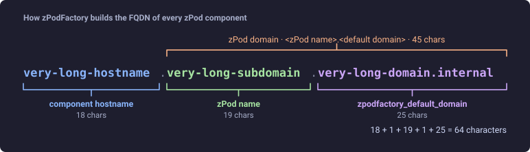
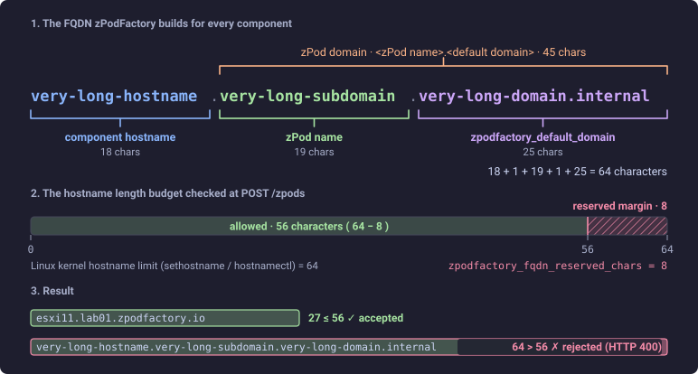

# Settings & feature flags

Every tunable in zPodFactory lives in the global `Setting` table as a row with a `name`, a string `value`, and a `description`. There are two families, and this page is the reference for both:

- **Core settings**, prefixed `zpodfactory_*` — things the framework needs to operate (host, domain, SSH key, download token, …).
- **Feature flags**, prefixed `ff_*` — optional behavior switches for zPod creation, networking, deployment, and destroy.

Operators manage all of them with the same CLI or API:

```bash
zcli setting list
zcli setting update  <name> -v <value>                    # change a setting that already exists
zcli setting create  -n <name> -v <value> [-d "<text>"]   # add one that is not seeded
zcli setting delete  <name>
```

Settings are read at the point of use — changes take effect on the next operation, with no restart required.

## Seeded at startup

Since the bootstrap scripts moved to a single default-settings list in `zpodapi` (`scripts/startup/zpodfactory_default_settings.py`), the API **creates the core settings and the most common feature flags automatically** and gives them a default value. The list is applied twice:

- on a fresh install, together with the initial superuser (`zpodfactory_load_initial_data.py`);
- on **every API start** (`zpodfactory_load_default_settings.py`, run from `prestart.sh`), which backfills any setting a newer release introduced.

Neither pass ever overwrites a row that already exists, so a value you changed is never reset. The flip side: **deleting a seeded row only lasts until the next restart**, when it comes back with its default. To turn a seeded flag off, `update` its value instead of deleting it.

| Setting | Seeded default | Section |
| --- | --- | --- |
| `zpodfactory_host` | the API host address | [Core settings](#zpodfactory_host) |
| `zpodfactory_debug_level` | `INFO` | [Core settings](#zpodfactory_debug_level) |
| `zpodfactory_default_domain` | `zpodfactory.io` | [Core settings](#zpodfactory_default_domain) |
| `zpodfactory_broadcom_download_token` | empty | [Core settings](#zpodfactory_broadcom_download_token) |
| `zpodfactory_ssh_key` | empty | [Core settings](#zpodfactory_ssh_key) |
| `zpodfactory_fqdn_reserved_chars` | `8` | [Core settings](#zpodfactory_fqdn_reserved_chars) |
| `ff_esxi_hostname_is_fqdn` | `true` | [Component deployment](#ff_esxi_hostname_is_fqdn) |
| `ff_endpoint_ova_staging` | `false` | [Component deployment](#ff_endpoint_ova_staging) |
| `ff_reuse_zpod_password` | `false` | [zPod creation](#ff_reuse_zpod_password) |
| `ff_nsx_clean_orphan_ports` | `false` | [zPod destroy](#ff_nsx_clean_orphan_ports) |

Every other setting below is **on-demand**: it does not exist until you `create` it, and the default behavior applies while it is absent. Per-object settings (`license_<component>-<version>`, `ff_max_zpods_<username>`, `ff_zpod_<zpod_name>_subnet`) are always on-demand since their name depends on your data.

!!! info "Truthiness"
    Most boolean flags require the literal string `"true"` (lowercase). Anything else (`"True"`, `"1"`, `"yes"`) is treated as off. A few flags (noted below) treat any non-empty string as on.

## Core settings

### `zpodfactory_host`

IP address or hostname of the zPodFactory appliance as seen from the endpoints. Used for NTP, the ISO datastore path, and anything a zPod component must reach back on.

- **Seeded:** yes, from the API's configured host (verify it after a fresh install — inside the container this may not be the address you want)
- **Value:** IP or FQDN

### `zpodfactory_debug_level`

Runtime log verbosity for the API and engine.

- **Seeded:** yes, default `INFO`
- **Value:** `INFO` or `DEBUG`

### `zpodfactory_default_domain`

Base domain for every zPod. A zPod named `test` gets the domain `test.<default domain>` unless a domain override is passed at creation, and every component FQDN is `<hostname>.<zpod domain>`:



- **Seeded:** yes, default `zpodfactory.io`
- **Value:** DNS domain

### `zpodfactory_broadcom_download_token`

Per-customer download token from the [Broadcom Support Portal](https://support.broadcom.com/), used by the download engine to fetch VMware product binaries. See [Broadcom download token](broadcom-download-token.md) for how to obtain and configure it.

- **Seeded:** yes, default empty (downloads fail with 401/403 until set; `zcli component upload` still works)
- **Value:** token string

### `zpodfactory_ssh_key`

Public SSH key pushed to zPod components (`zcore`, `esxi`, …) for passwordless access.

- **Seeded:** yes, default empty
- **Value:** one public key line

### `zpodfactory_fqdn_reserved_chars`

Safety margin subtracted from the **64-character Linux kernel hostname limit** when validating zPod component FQDNs. `POST /zpods` and `POST /zpods/{id}/components` compute the longest FQDN the deploy would produce (`<hostname>.<zpod>.<default domain>`, or the explicit domain override) and reject the request when it exceeds `64 - margin` characters.

DNS accepts names up to 253 characters, so without this check the name would resolve fine and the failure would only appear later, when `hostnamectl` refuses the FQDN during guest customization. The check surfaces it before any provisioning starts, with an error that names the offending FQDN and the limit.



- **Seeded:** yes, default `8`
- **Value:** non-negative integer
- **Example:** `zcli setting update zpodfactory_fqdn_reserved_chars -v 4` to allow a few more characters; otherwise shorten the zPod name, domain, or component hostname.

### `license_<component>-<version>`

License key applied automatically after the matching component is deployed. Supports vCenter and NSX keys; several NSX keys can be configured.

- **Seeded:** no (per-component, on-demand)
- **Value:** license key string
- **Example:** `zcli setting create -n license_vcsa-8.0u3 -v "XXXXX-XXXXX-XXXXX-XXXXX-XXXXX"`

## Feature flags: zPod creation

### `ff_unique_zpod_password`

Forces every new zPod to use this exact password instead of a randomly generated one.

- **Seeded:** no (on-demand)
- **Value:** any non-empty string (the literal password)
- **Example:** `zcli setting create -n ff_unique_zpod_password -v "VMware1!"`

!!! warning "VMware password requirements"

    When this flag is unset, zPodFactory generates random 16-character passwords designed to work across all VMware products deployed in a zPod (uppercase, lowercase, digit, and special character).

    Setting a personal or shared password here may break provisioning if a product rejects it — for example VCF now enforces a **15-character minimum**, or policies that disallow passwords that are too short, too simple, or missing required character classes.

### `ff_reuse_zpod_password`

When creating a zPod whose name matches a previously deleted one, reuse that zPod's password. Handy for test/QA loops where browsers and password managers already know the credentials.

- **Seeded:** yes, default `false`
- **Value:** `"true"` to enable
- **Example:** `zcli setting update ff_reuse_zpod_password -v true`

### `ff_restrict_zpod_with_username_prefix`

Non-superadmin users must name their zPods `<username>-<anything>`. Superadmins are exempt.

- **Seeded:** no (on-demand)
- **Value:** `"true"` to enable
- **Example:** `zcli setting create -n ff_restrict_zpod_with_username_prefix -v true`

### `ff_default_config_scripts`

Comma-separated list of config-script names auto-applied to new zPods that do not supply their own `config-scripts` feature.

- **Seeded:** no (on-demand)
- **Value:** comma-separated string, no spaces (e.g. `vdsnsx,sample`)
- **Example:** `zcli setting create -n ff_default_config_scripts -v "vdsnsx"`
- See [Config scripts](../extensibility/config-scripts.md) for details.

### `ff_zpod_default_profile`

Default profile for `zcli zpod create` when `--profile/-p` is omitted. If unset, the CLI requires a profile.

- **Seeded:** no (on-demand)
- **Value:** profile name
- **Example:** `zcli setting create -n ff_zpod_default_profile -v base`

### `ff_max_zpods_per_user`

Cap on how many active zPods a non-superadmin user can own. `0`, missing, or non-numeric means unlimited. Superadmins are exempt. Counts only zPods where the user has `OWNER` permission and status is not `DELETED`.

- **Seeded:** no (on-demand)
- **Value:** positive integer
- **Example:** `zcli setting create -n ff_max_zpods_per_user -v 3`

### `ff_max_zpods_<username>`

Per-user override of `ff_max_zpods_per_user`. When set, it fully replaces the global value for that user — including `0`/invalid, which means unlimited for that user. Superadmins are still exempt.

- **Seeded:** no (per-user, on-demand)
- **Value:** positive integer; `0`/invalid ⇒ unlimited for this user
- **Example:** `zcli setting create -n ff_max_zpods_alice -v 10`
- **Example (grant unlimited):** `zcli setting create -n ff_max_zpods_bob -v 0`

## Feature flags: zPod networking

### `ff_zpod_<zpod_name>_subnet`

Pin a specific zPod to a custom primary `/24` subnet instead of letting the engine allocate one. Must match the configured public-network prefix length (default `/24`). On a prefix-length mismatch or a parse error the engine logs a warning in the deploy task and falls back to normal allocation — it does not fail the deployment.

- **Seeded:** no (per-zPod, on-demand)
- **Value:** CIDR string (e.g. `10.96.42.0/24`)
- **Example:** `zcli setting create -n ff_zpod_lab01_subnet -v 10.96.42.0/24`

## Feature flags: component deployment

### `ff_esxi_hostname_is_fqdn`

For ESXi components, set the hostname to the full FQDN (`<short>.<domain>`) instead of the short name during OVF deploy. This is what [William Lam](https://williamlam.com/) VMware ESXi templates expect, which is why it is now **on by default**.

- **Seeded:** yes, default `true`
- **Value:** any non-empty string is on (no `"true"` requirement)
- **Disable:** `zcli setting update ff_esxi_hostname_is_fqdn -v ""` — an empty value is off. Deleting the row re-enables it at the next API restart.

### `ff_component_wait_for_status`

When adding an **NSX Manager** component, the post-script step already waits for the management cluster status to be `STABLE`. With this flag on, it additionally requires the detailed cluster `overall_status` to be `STABLE` before continuing, which avoids running NSX post-scripts against a manager that is up but not yet fully converged.

- **Seeded:** no (on-demand)
- **Value:** `"true"` to enable
- **Example:** `zcli setting create -n ff_component_wait_for_status -v true`

### `ff_endpoint_ova_staging`

Stage L1 OVAs once as VM templates on the endpoint vCenter and clone them for each deployment instead of re-uploading the full OVA every time. Experimental; off by default. Any staging or clone failure falls back to the direct OVA import, so enabling it cannot break a deployment on its own.

- **Seeded:** yes, default `false`
- **Value:** `"true"` to enable
- **Example:** `zcli setting update ff_endpoint_ova_staging -v true`

See [Endpoint OVA staging](endpoint-ova-staging.md) for architecture and operating notes.

## Feature flags: zPod destroy

### `ff_nsx_clean_orphan_ports`

During `zpod destroy` on an NSX-T endpoint, the engine waits for the zPod segment to drain before deleting it. When NSX Manager's inventory is stale — typically after a host died and was removed from vCenter/NSX without its VMs being re-homed — a segment port can stay attached forever and the destroy fails with `Segment has connected ports`.

When this flag is on and the drain wait times out, the engine audits the remaining ports, and **deletes only those whose VM no longer exists in vCenter**, then waits once more. Ports whose VM is still present are never touched, whatever NSX reports. When the flag is off (the default), the same audit runs but only reports the orphan ports in the task log and the destroy fails as before.

- **Seeded:** yes, default `false`
- **Value:** `"true"` to enable
- **Example:** `zcli setting update ff_nsx_clean_orphan_ports -v true`
- **Troubleshooting:** every line this feature logs is prefixed with `[ff_nsx_clean_orphan_ports]`, so `grep` that tag in the destroy task log to see the per-port verdicts.
