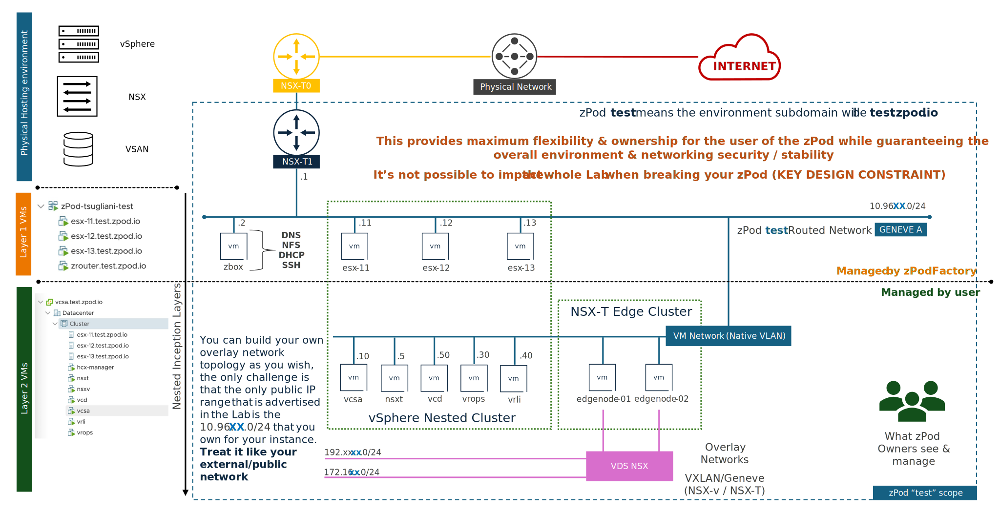
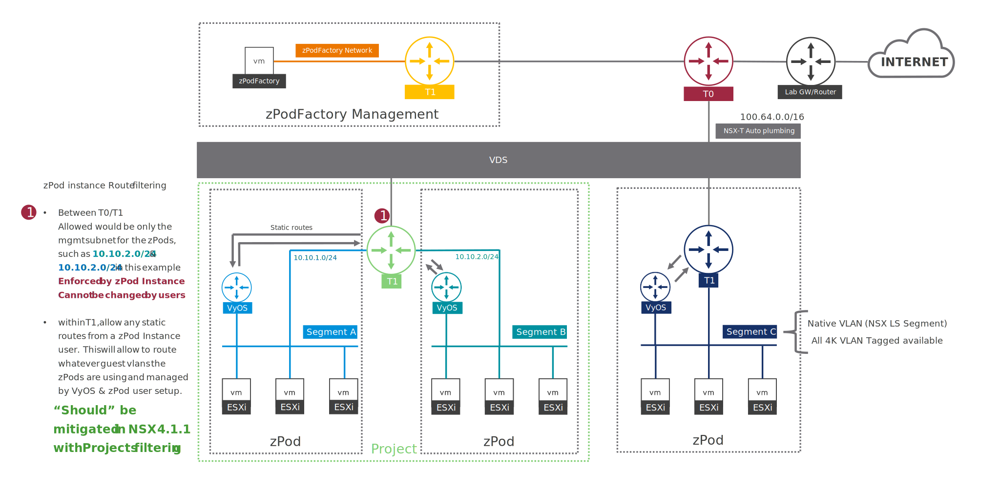
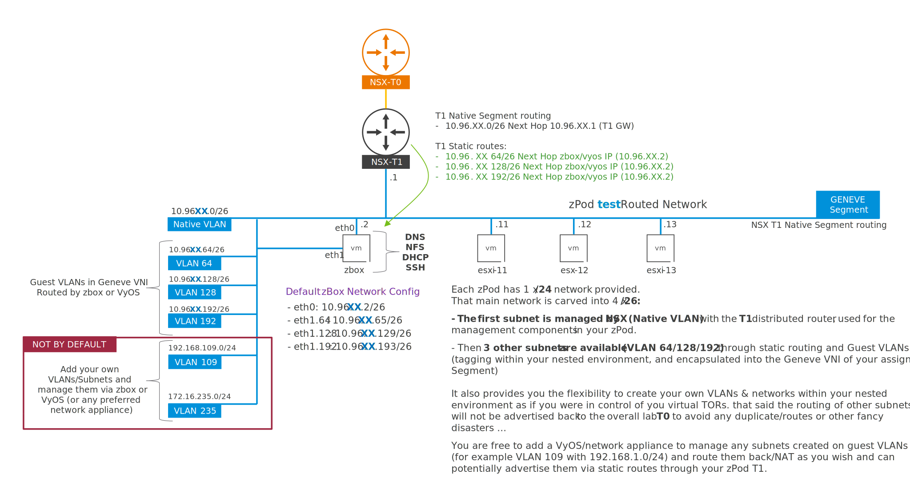
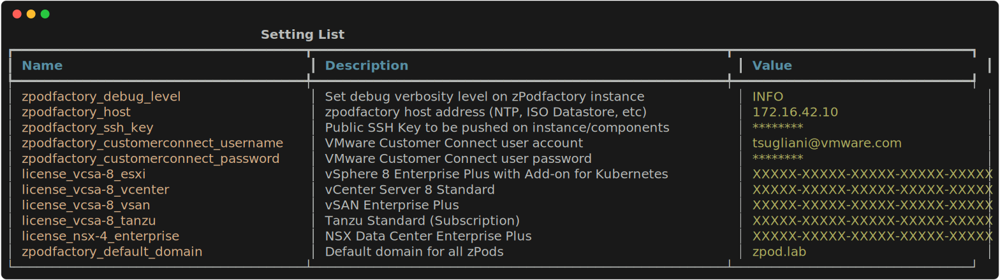
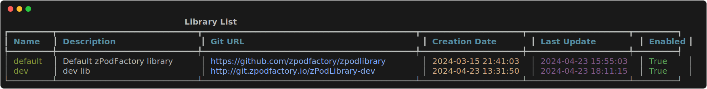
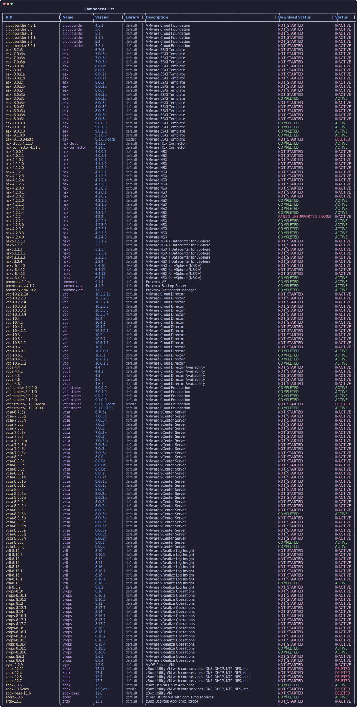
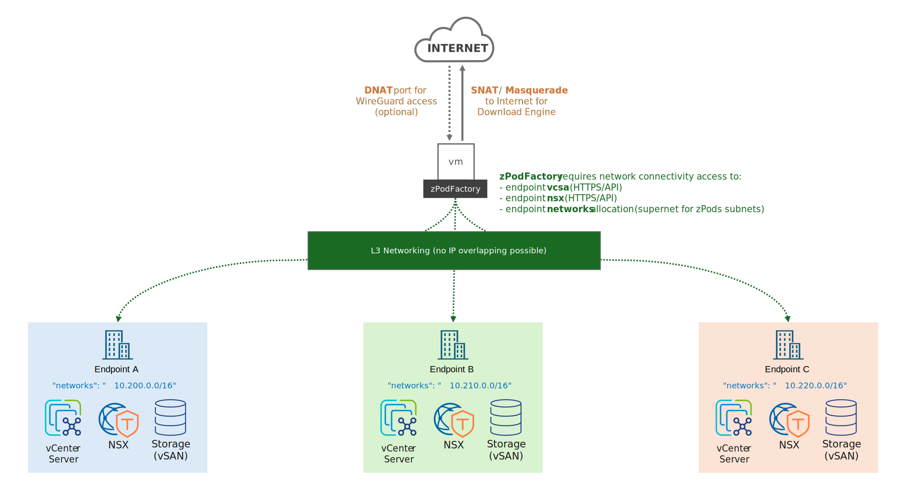
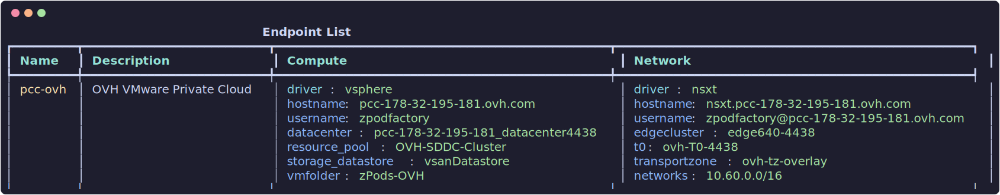
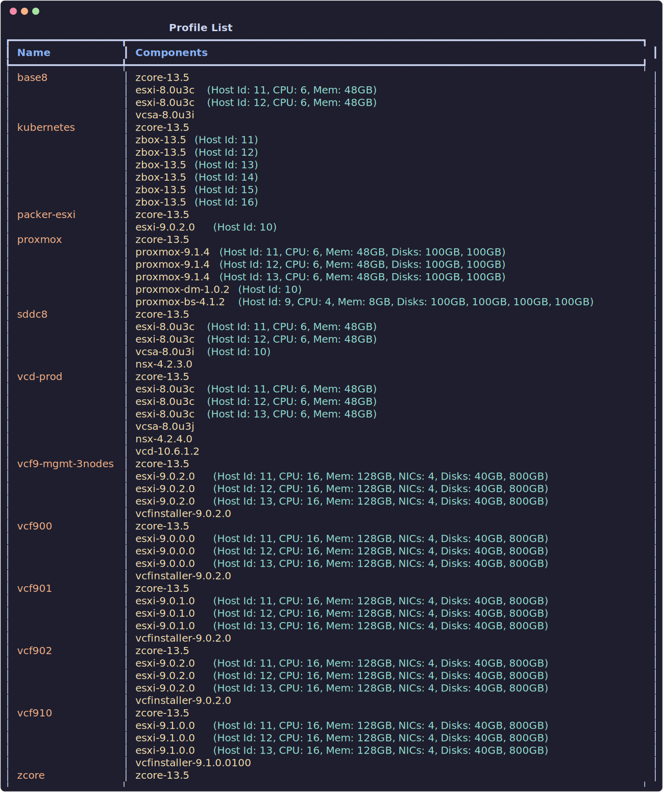

# Admin Guide

To use efficiently the zPodFactory framework, you need to understand the following concepts depicted in the diagram below:

## Overview High Level Diagram



- Top left in Blue you can see the physical environment used to host the nested environments (zPods). This is basically the `endpoint` in the zPodFactory framework. I've also depicted on the center part, how the "global" NSX configuration would look like from a simple deployment (single endpoint)

!!! info

    You can check the endpoint section for more information on how to configure an endpoints here: [Manage endpoints](../admin/index.md#manage-endpoints)


- Center Left in Orange, you can see the nested environment from an administrator perspective, basically all the Layer 1 VMs. You can see the main components that are deployed at L1 which are the **`zcore`** (mandatory core appliance; legacy zPods may still show `zbox`) and the **`esxi`** components. The core component manages DNS/DHCP, NFS storage, and routing for the guest VLAN subnets. The `esxi` components are the nested environment hosts. The main important part here is the zPod Network, which is managed by an admin, and protects every nested environment from each other and also the physical environment.

- Bottom left in Green shows what a User can see from his POV, he will never see the 2 above layers, unless he is a zPodFactory administrator, but he will see/access the nested environment from his perspective, which is usually the vCenter Server, and the components in it and have full control over those components as the zPod password is admin for every component in that nested environment. In the Center part, you could see what a User would potentially build in the nested environment, which is usually a vCenter Server, a NSX-T Manager, a NSX-T overlay network on top of the zPod Network and then VMs connected to that overlay network.


## Network High Level Diagram

Now from a more detailed networking perspective that shows 2 main NSX capabilities:



Depending on which NSX version you have installed at the physical layer, you may be able to use the recent `NSX Projects` feature, which aims to build multi-tenancy in the NSX environment.

- On the bottom left side you can see a Project construct that encompasses 1 or more zPods (2 in this example)
- On the bottom right side you can see a zPod not using Projects at all.

!!! warning

    To leverage NSX Projects you will need to use NSX 4.1.1 or above for full support.


Using NSX Projects are highly recommended as they provide a lot of benefits around the permissions that we can provide on the networking layer of the nested environments.  This gives users a lot of flexibility (creating VLANs/subnets, and routing them without any administrator interaction), and also to provide security for admins who can filter the routes being advertised from the zPod Network T1 Connected Segment to the main T0 of the physical environment.


Once the zPodFactory framework is deployed and running, you can start using the CLI to configure and manage the framework.

## Nested Networking Diagram

This is what a user will be able to use/leverage on any nested zPod he deploys.



Each zPod has 1 overall network (1 x /24 subnet that we carve into 4 x /26)

Example: zPod "test" has `10.96.10.0/24`

We will have the following networks managed:

- Subnet `10.96.10.0/26` (Native VLAN, untagged, Management VLAN for components deployed): This Subnet is managed and routed by NSX T1.
- Subnet `10.96.10.64.0/26` (VLAN 64, tagged): This subnet is by default routed by the **`zcore`** component (legacy zPods may use `zbox`), but we will offer the ability to change the routing to a `vyos` component in the future
- Subnet `10.96.10.128.0/26` (VLAN 128, tagged): This subnet is by default routed by the **`zcore`** component, but we will offer the ability to change the routing to a `vyos` component in the future
- Subnet `10.96.10.192.0/26` (VLAN 192, tagged): This subnet is by default routed by the **`zcore`** component, but we will offer the ability to change the routing to a `vyos` component in the future

Those VLANs should simplify the initial deployment and configuration of NSX in the nested layer so you can setup Host/Edge Nodes TEPs/Public subnets on different VLANs as you see fit.

!!! info
    This does not mean you cannot add any new VLANs, those are just the default networks/VLANs configured that are configured AND advertised upstream through the T0.

    As you can imagine, we need to avoid advertising any non-managed networks upstream or 2 users could for example try to advertise back the same subnet such as 192.168.1.0/24 and this would bring many issues we want to avoid.

    **PS:** When using NSX Projects you can have control on the T1 of your zPod to add any static routes as you see fit, meaning you could for example add VLAN 100 with the subnet `192.168.1.0/24` and it will be ONLY be available on your zPod. As you can imagine if you add a subnet, you'll need to route that subnet to a next hop that you have to manage yourself using `zcore`, `vyos`, or `NSX` if this is an overlay networking sitting on Geneve for example.


## Introduction

`zcli` is a command line tool that allows you to manage your zPods and the whole zPodFactory framework.

## CLI Installation

Using `pip`:

``` { data-copy="pip install zpodcli" }
❯ pip install zpodcli
```

Verify that the CLI is now available and working:

``` { data-copy="zcli"}
❯ zcli

 Usage: zcli [OPTIONS] COMMAND [ARGS]...

╭─ Options ───────────────────────────────────────────────────────────────────╮
│ --factory             -f      TEXT  Use specific factory for this commmand. │
│ --output-svg                        Output an SVG file for any list command.│
│ --version             -V            Display version information.            │
│ --install-completion                Install completion for this shell.      │
│ --help                              Show this message and exit.             │
╰─────────────────────────────────────────────────────────────────────────────╯
╭─ Commands ──────────────────────────────────────────────────────────────────╮
│ component                          Manage Components                        │
│ endpoint                           Manage Endpoints                         │
│ enet                               Manage ENets                             │
│ factory                            Manage Factories                         │
│ group                              Manage Permission Groups                 │
│ library                            Manage Libraries                         │
│ profile                            Manage Profiles                          │
│ setting                            Manage Settings                          │
│ user                               Manage Users                             │
│ zpod                               Manage zPods                             │
╰─────────────────────────────────────────────────────────────────────────────╯
```

## Authentication

The first thing you need to do is to connect to the zPodFactory API as an administrator which is called `superuser` which has `superadmin` privileges.

`superadmin` is a special role that has **ALL** the permissions in the zPodFactory framework.


This user has the ability to do everything in the zPodFactory framework.

First thing is to connect to the server with the superuser token provided. (This is done automatically within the zPodFactory appliance)

``` {data-copy="zcli factory add myfactory -s http://zpodfactory.domain.lab:8000 -t TOKEN -a}
❯ zcli factory add myfactory -s http://zpodfactory.domain.lab:8000 -t "TOKEN" -a
```

## Manage settings

This is the main entry point to configure the framework, which requires very important information to be able to operate correctly.

In the [manual installation](../install/manual.md) guide, we provided an example `deploy.sh` script to help setup those settings correctly, but we will explain every relevant one here:

- `zpodfactory_host`: IP of the VM where zPodFactory runs (used for NTP, ISO datastore paths, etc.).
- `zpodfactory_default_domain`: Base domain name for each deployed zPod (e.g. zPod `test` → `test.zpodfactory.domain`).
- `zpodfactory_ssh_key`: SSH public key pushed to zPod components (`zcore`, `esxi`, etc.) for SSH access.
- `zpodfactory_broadcom_download_token`: Per-customer download token from the [Broadcom Support Portal](https://support.broadcom.com/) used by the download engine for VMware product binaries. See [Broadcom download token](broadcom-download-token.md) for how to obtain and configure it.
- `zpodfactory_debug_level`: Runtime log verbosity (`INFO` or `DEBUG`). Changes take effect without restart.

!!! warning "Download engine"

    The legacy `zpodfactory_customerconnect_username` / `zpodfactory_customerconnect_password` settings are **no longer used**. VMware product downloads go through the Broadcom depot with `zpodfactory_broadcom_download_token`.

    If the token is missing or invalid, component enable/download will fail with a 401/403. You can still use `zcli component upload` to provide OVA files manually.

- `license_<component>-<version>`: Auto-apply licenses after component deploy. Supports vCenter and NSX license keys (multiple NSX keys can be configured).

See [Feature flags](feature-flags.md) for optional `ff_*` settings that control zPod creation, networking, and deployment behavior.


``` {data-copy="zcli setting list"}
❯ zcli setting list
```



## Manage users

List users:

``` {data-copy="zcli user list"}
❯ zcli user list
```


Create, update, enable/disable, or reset API tokens:

```bash
zcli user add <username> --email user@example.com
zcli user update <username> --email new@example.com
zcli user enable <username>
zcli user disable <username>
zcli user reset_api_token <username>
```

Use `zcli user list --all` to include disabled users.

## Manage groups

Permission groups bundle users for zPod and endpoint access:

```bash
zcli group list
zcli group create <name> -d "Description"
zcli group update <name> -d "New description"
zcli group delete <name>
zcli group user add <group> <username>
zcli group user remove <group> <username>
```

## Manage permissions

zPodFactory supports RBAC on zPods and endpoints with three permission levels:

| Level | Capabilities |
| --- | --- |
| `OWNER` | Full control including destroy and permission management |
| `ADMIN` | Maintain zPod (components, DNS, permissions); superadmins receive a virtual `ADMIN` on all zPods |
| `USER` | Read access (components, DNS, networks) |

### zPod permissions

```bash
zcli zpod permission list <zpod_name>
zcli zpod permission add <zpod_name> --user alice --permission OWNER
zcli zpod permission add <zpod_name> --group lab-admins --permission USER
zcli zpod permission remove <zpod_name> --user alice --permission OWNER
```

!!! warning "Last maintainer guard"
    You cannot remove the last `OWNER`/`ADMIN` from a zPod — doing so would orphan it. Reassign ownership first, or use a superadmin account.

The API also exposes `GET /zpods/{id}/permissions/mine` for UIs to discover the caller's effective permission level.

### Endpoint permissions

```bash
zcli endpoint permission list <endpoint_name>
zcli endpoint permission add <endpoint_name> --user alice --permission OWNER
zcli endpoint permission remove <endpoint_name> --group lab-admins --permission USER
```

## Manage library

By default zPodFactory comes with a default library that contains all the "official" vmware and misc supported `components` supported by the framework.

This library is stored in a [git repository](https://github.com/zpodfactory/zpodlibrary) and is cloned locally, and used to fetch all `components` metadata (mainly the OVA binary files with some misc information) we use to manage the products.

Listing libraries:

``` {data-copy="zcli library list"}
❯ zcli library list
```



> PS: The `default` library is the only one available for now, but the framework is designed to be able to support multiple libraries.

Resync the library:

``` {data-copy="zcli library resync default"}
❯ zcli library resync default
```

> PS: The `resync` command will refresh all the `components` metadata from the git repository, and will update the local database with the new information.

## Manage components

Most administrators use the **Components** page in [zpodweb](../user/web-ui.md#components) — a searchable, filterable catalog where you can enable or disable components, watch download progress, and upload OVA/ISO files via file picker. The CLI commands below call the same zPod API.

Enabling a component triggers the embedded download engine. Configure `zpodfactory_broadcom_download_token` first for VMware products from the Broadcom depot — set it under **Settings** in the Web UI, or via CLI (see [Broadcom download token](broadcom-download-token.md)). When depot download is not possible, use **Upload** in the Web UI or `zcli component upload` for manual OVA provisioning.

List all `components`:

``` {data-copy="zcli component list -a"}
❯ zcli component list -a
```



List all available components (ready to deploy):

``` {data-copy="zcli component list"}
❯ zcli component list
```


Enable a `component` (make it available for deployment):

In **zpodweb**, open **Components**, find the component, and click **Enable** — the same download flow runs as the CLI command below.

!!! info "Download engines"

    The download engine supports the **`https`** engine only (direct wget from URLs in the library). VMware product URLs use the Broadcom offline depot layout with a `${BROADCOM_DOWNLOAD_TOKEN}` placeholder substituted at runtime.

    Non-VMware components (such as `zcore`) may use direct HTTPS URLs. The upload feature remains available as a fallback — checksum verification matches the file against library metadata and enables the correct component automatically.

You will need to use the `component` UID (unique name of the `component`, as depicted in the list command above)

``` {data-copy="zcli component enable zcore-13.5"}
❯ zcli component enable zcore-13.5
```

Disable a component (removes the product file from disk):

``` {data-copy="zcli component disable vcsa-8.0u3i"}
❯ zcli component disable vcsa-8.0u3i
```

Upload a `component` to zPodFactory:

In **zpodweb**, use **Components → Upload** to select an OVA or ISO file from your workstation.

``` {data-copy="zcli component upload /path/to/vmware-product.ova"}
❯ zcli component upload /tmp/VMware-Cloud-Builder-5.1.1.0-23480823_OVF10.ova
```

You can follow progress in **zpodweb** (Components list shows download percentage and status), with `zcli component list`, or inspect a specific component:

``` {data-copy="zcli component get vcsa-8.0u3i"}
❯ zcli component get vcsa-8.0u3i
```

JSON output is available on list/get commands with `-j` / `--json` for automation.


## Manage endpoints

Endpoints are the target physical environments a nested environment will be built upon.

The framework is designed to be able to support multiple endpoints, and to be able to deploy nested environments on different physical environments.

!!! warning

    Network connectivity from the zPodFactory Appliance to the following is **MANDATORY**:

    - VMware vCenter Server (HTTPS API)
    - VMware ESXi Hosts (OVF/OVA uploads)
    - VMware NSX-T Manager (HTTPS API)
    - VMware NSX-T `networks` supernet L3 connectivity



List all endpoints:

``` {data-copy="zcli endpoint list"}
❯ zcli endpoint list
```



Create an endpoint:

``` {data-copy="zcli endpoint add"}
❯ zcli endpoint create

 Usage: zcli endpoint create [OPTIONS] ENDPOINT_NAME

 Endpoint Create

╭─ Arguments ──────────────────────────────────────────────────────────╮
│ *    endpoint_name      TEXT  Endpoint name [required]               │
╰──────────────────────────────────────────────────────────────────────╯
╭─ Options ────────────────────────────────────────────────────────────╮
│ --description     -d       TEXT  Description                         │
│ --endpoints       -e       TEXT  Endpoints json                      │
│ --endpoints-file  -ef      PATH  File containing endpoints json      │
│ --help                           Show this message and exit.         │
╰──────────────────────────────────────────────────────────────────────╯

```

If you just want to create a simple endpoint, you can use the interactive command or generate a sample JSON file:

``` {data-copy="zcli endpoint create sddc-lab --generate-config-sample"}
❯ zcli endpoint create testendpoint --generate-config-sample
```

This writes `testendpoint-sample.json` that you can edit and pass back with `--endpoints-file`.

Interactive creation:

``` {data-copy="zcli endpoint create sddc-lab"}
❯ zcli endpoint create testendpoint

Compute Endpoint
driver [vsphere] (vsphere):
hostname: vcenter.fqdn.lab
username: zpodserviceuser@fqdn.lab
password: ********
datacenter: Datacenter-Paris
resource_pool: Cluster-SDDC
storage_datastore: vsanDatastore
vmfolder: zPods-Paris

Network Endpoint
driver [nsxt/nsxt_projects] (nsxt_projects):
hostname: nsx.fqdn.lab
username (admin):
password: ********
networks: 10.130.0.0/16
transportzone: default-tz-overlay
edgecluster: edgeclustername
t0: T0-Lab
Endpoint testendpoint has been created.

```

This will allow for interactive creation of an endpoint and prompt for all the required information.

Inspect or export an endpoint:

```bash
zcli endpoint info <endpoint_name>
zcli endpoint info <endpoint_name> -j    # JSON
zcli endpoint update <endpoint_name> ...
zcli endpoint delete <endpoint_name>
```

### ENets

ENets (endpoint networks) are superadmin-only constructs for advanced endpoint networking:

```bash
zcli enet list
zcli enet create <name> ...
zcli enet delete <name>
```


## Manage profiles

`Profiles` are a collection of `components` grouped together to form an initial nested environment.

They are the main entry point to deploy a nested environment and require a mandatory **`zcore-*`** core component as the **first** element (legacy `zbox-*` profiles must be migrated — see [zcore migration](zcore-migration.md)).

The core appliance (`zcore`) provides DNS/DHCP (dnsmasq), NFS storage for nested ESXi hosts, and routing for the three additional `/26` subnets on VLANs 64/128/192.

Profile entries support optional per-component overrides:

| Field | Applies to | Description |
| --- | --- | --- |
| `host_id` | esxi, etc. | Management subnet host ID |
| `hostname` | esxi, etc. | Short hostname |
| `vcpu`, `vmem` | esxi, proxmox, etc. | Sizing overrides |
| `vnics` | esxi, etc. | vNIC count (integer, e.g. `4`) |
| `vdisks` | esxi | Extra virtual disk sizes in GB (array of integers, e.g. `[40, 800]`) |

``` {data-copy="zcli profile list"}
❯ zcli profile list
```

Use `-j` for JSON output (used by `just zcore-transition` and automation):

```bash
zcli profile info <name> -j
zcli profile create <name> -pf profile.json
zcli profile update <name> -pf profile.json
zcli profile delete <name>
```


