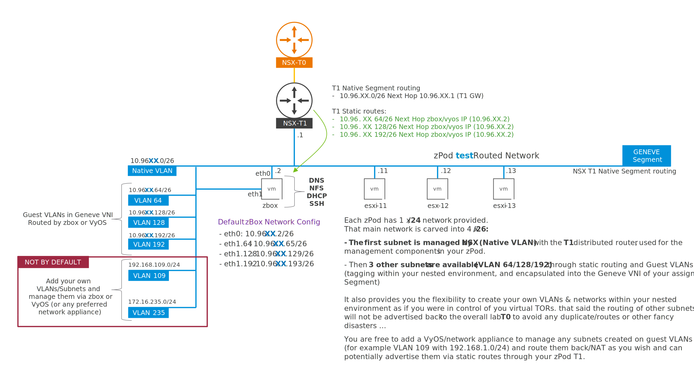
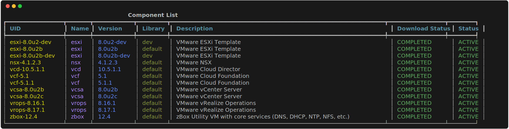

# Admin Guide

To use efficiently the zPodFactory framework, you need to understand the following concepts depicted in the diagram below:

## Overview High Level Diagram


- Top left in Blue you can see the physical environment used to host the nested environments (zPods). This is basically the `endpoint` in the zPodFactory framework. I've also depicted on the center part, how the "global" NSX configuration would look like from a simple deployment (single endpoint)

!!! info

    You can check the endpoint section for more information on how to configure an endpoints here: [Manage endpoints](../admin/index.md#manage-endpoints)


- Center Left in Orange, you can see the nested environment from an administrator perspective, basically all the Layer 1 VMs. You can see the main components that are deployed at L1 which are the `zbox` and the `esxi` components. The `zbox` component is the main component that is used to manage the nested environment, and the `esxi` component is the nested environment hosts, the main important part here is the zPod Network, which is managed by an admin, and protecting every nested environment from each other and also the physical environment.

- Bottom left in Green shows what a User can see from his POV, he will never see the 2 above layers, unless he is a zPodFactory administrator, but he will see/access the nested environment from his perspective, which is usually the vCenter Server, and the components in it and have full control over those components as the zPod password is admin for every component in that nested environment. In the Center part, you could see what a User would potentially build in the nested environment, which is usually a vCenter Server, a NSX-T Manager, a NSX-T overlay network on top of the zPod Network and then VMs connected to that overlay network.


## Network High Level Diagram

Now from a more detailed networking perspective that shows 2 main NSX capabilities:


Depending on which NSX version you have installed at the physical layer, you may be able to use the recent `NSX Projects` feature, which aims to build multi-tenancy in the NSX environment.

- On the bottom left side you can see a Project construct that encompasses 1 or more zPods (2 in this example)
- On the bottom right side you can see a zPod not using Projects at all.

!!! warning

    To leverage NSX Projects you will need to use NSX 4.1.1 or above for full support.


Using NSX Projects are highly recommended as they provide a lot of benefits around the permissions that we can provide on the networking layer of the nested environments.  This gives users a lot of flexibility (creating VLANs/subnets, and routing them without any administrator interaction), and also to provide security for admins who can filter the routes being advertised from the zPod Network T1 Connected Segment to the main T0 of the physical environment.


Once the zPodFactory framework is deployed and running, you can start using the CLI to configure and manage the framework.

## Nested Networking Diagram

This is what a user will be able to use/leverage on any nested zPod he deploys.



Each zPod has 1 overall network (1 x /24 subnet that we carve into 4 x /26)

Example: zPod "test" has `10.96.10.0/24`

We will have the following networks managed:

- Subnet `10.96.10.0/26` (Native VLAN, untagged, Management VLAN for components deployed): This Subnet is managed and routed by NSX T1.
- Subnet `10.96.10.64.0/26` (VLAN 64, tagged): This subnet is by default routed by the `zbox` component, but we will offer the ability to change the routing to a `vyos` component in the future
- Subnet `10.96.10.128.0/26` (VLAN 128, tagged): This subnet is by default routed by the `zbox` component, but we will offer the ability to change the routing to a `vyos` component in the future
- Subnet `10.96.10.192.0/26` (VLAN 192, tagged): This subnet is by default routed by the `zbox` component, but we will offer the ability to change the routing to a `vyos` component in the future

Those VLANs should simplify the initial deployment and configuration of NSX in the nested layer so you can setup Host/Edge Nodes TEPs/Public subnets on different VLANs as you see fit.

!!! info
    This does not mean you cannot add any new VLANs, those are just the default networks/VLANs configured that are configured AND advertised upstream through the T0.

    As you can imagine, we need to avoid advertising any non-managed networks upstream or 2 users could for example try to advertise back the same subnet such as 192.168.1.0/24 and this would bring many issues we want to avoid.

    **PS:** When using NSX Projects you can have control on the T1 of your zPod to add any static routes as you see fit, meaning you could for example add VLAN 100 with the subnet `192.168.1.0/24` and it will be ONLY be available on your zPod. As you can imagine if you add a subnet, you'll need to route that subnet to a next hop that you have to manage yourself using `zbox`, `vyos`, or `NSX` if this is an overlay networking sitting on Geneve for example.


## Introduction

`zcli` is a command line tool that allows you to manage your zPods and the whole zPodFactory framework.

## CLI Installation

Using `pip`:

``` { data-copy="pip install zpodcli" }
❯ pip install zpodcli
```

Verify that the CLI is now available and working:

``` { data-copy="zcli"}
❯ zcli

 Usage: zcli [OPTIONS] COMMAND [ARGS]...

╭─ Options ─────────────────────────────────────────────────────────────────────────────────────────────────────────────╮
│ --factory             -f      TEXT  Use specified factory for current commmand.                                       │
│ --output-svg                        Output an SVG file for any list command.                                          │
│ --version             -V            Display version information.                                                      │
│ --install-completion                Install completion for the current shell.                                         │
│ --show-completion                   Show completion for the current shell, to copy it or customize the installation.  │
│ --help                              Show this message and exit.                                                       │
╰───────────────────────────────────────────────────────────────────────────────────────────────────────────────────────╯
╭─ Commands ────────────────────────────────────────────────────────────────────────────────────────────────────────────╮
│ component                          Manage Components                                                                  │
│ endpoint                           Manage Endpoints                                                                   │
│ enet                               Manage ENets                                                                       │
│ factory                            Manage Factories                                                                   │
│ group                              Manage Permission Groups                                                           │
│ library                            Manage Libraries                                                                   │
│ profile                            Manage Profiles                                                                    │
│ setting                            Manage Settings                                                                    │
│ user                               Manage Users                                                                       │
│ zpod                               Manage zPods                                                                       │
╰───────────────────────────────────────────────────────────────────────────────────────────────────────────────────────╯
```

## Authentication

The first thing you need to do is to connect to the zPodFactory API as an administrator which is called `superuser` which has `superadmin` privileges.

`superadmin` is a special role that has **ALL** the permissions in the zPodFactory framework.


This user has the ability to do everything in the zPodFactory framework.

First thing is to connect to the server with the superuser token provided. (This is done automatically within the zPodFactory appliance)

``` {data-copy="zcli factory add myfactory -s http://zpodfactory.domain.lab:8000 -t TOKEN -a}
❯ zcli factory add myfactory -s http://zpodfactory.domain.lab:8000 -t "TOKEN" -a
```

## Manage settings

This is the main entry point to configure the framework, which requires very important information to be able to operate correctly.

In the manual setup, we provided an example `deploy.sh` script to help setup those settings correctly, but we will explain every relevant one here:

- `zpodfactory_host`: This is the IP of the VM zPodFactory has been installed/running on.
- `zpodfactory_default_domain`: This is the base domain name that will be used for each deployed zPod. (e.g. if `test` is your zPod name, and if zpodfactory_default_domain is `zpodfactory.domain`, the FQDN of the zPod will be `test.zpodfactory.domain`)
- `zpodfactory_ssh_key`: This is the SSH Key that will be pushed to the zPod `zbox`, and `esxi` components to allow SSH access to those components.
- `zpodfactory_customerconnect_username`: This is the username of the customer connect account that will be used to download the VMware products binaries.
- `zpodfactory_customerconnect_password`: This is the password of the customer connect account that will be used to download the VMware products binaries.

!!! warning

    If you do not setup the customer connect credentials, the download engine will not work, and you will not be able to download any VMware products binaries.

    The download engine is a key component of the framework, and is used to download the VMware products binaries, and to deploy the nested environments.

    Right now there is no manual documentation/process that explains how to provide binaries/checksums etc to the zPodFramework yet !

- `license_<component>-<version>`: This is a facility to push automatically some licenses to components once deployed, right now we only support vCenter licenses, but very likely nsx will be the next to be supported.


``` {data-copy="zcli setting list"}
❯ zcli setting list
```


## Manage users

List users

``` {data-copy="zcli user list"}
❯ zcli user list
```


TBD

## Manage groups

TBD

## Manage permissions

TBD

## Manage library

By default zPodFactory comes with a default library that contains all the "official" vmware and misc supported `components` supported by the framework.

This library is stored in a [git repository](https://github.com/zpodfactory/zpodlibrary) and is cloned locally, and used to fetch all `components` metadata (mainly the OVA binary files with some misc information) we use to manage the products.

Listing libraries:

``` {data-copy="zcli library list"}
❯ zcli library list
```


> PS: The `default` library is the only one available for now, but the framework is designed to be able to support multiple libraries.

Resync the library:

``` {data-copy="zcli library resync default"}
❯ zcli library resync default
```

> PS: The `resync` command will refresh all the `components` metadata from the git repository, and will update the local database with the new information.

## Manage components

List all `components`:

``` {data-copy="zcli component list -a"}
❯ zcli component list -a
```


List all available components (ready to deploy):

``` {data-copy="zcli component list"}
❯ zcli component list
```



Enable a `component` (make it available for deployment):

This will trigger the embedded download engine (Make sure that you configured your customer connect credentials in the settings or this task will fail)

!!! warning

    **Since April 2024**

    The download engine is not working for VMware products anymore since Broadcom terminated the customer connect VMware website.
    It will still work for non VMware products, such as zbox download, etc.

    To workaround the issue, we have built an embedded `upload` feature that allows you to upload your own OVA files to the framework using the `zcli` command.

    By checking the file checksum, it will be able to cross-check automatically from all supported components and will enable the appropriate component.


You will need to use the `component` UID (unique name of the `component`, as depicted in the list command above)

``` {data-copy="zcli component enable zbox-12.7"}
❯ zcli component enable zbox-12.7
```
!!! info

    Until there is an official method to download VMware products automatically with the Broadcom Support Portal, you can use the `upload` feature to upload your own OVA files to the framework.

Upload a `component` to zPodFactory:

``` {data-copy="zcli component upoad /path/to/vmware-product.extension"}
❯ zcli component upload /tmp/VMware-Cloud-Builder-5.1.1.0-23480823_OVF10.ova
```

you can then follow the progress using `zcli component list`, or get on a specific `component` UID as depicted below:

``` {data-copy="zcli component get vcsa-8.0u3d"}
❯ zcli component get vcsa-8.0u3d
```


## Manage endpoints

Endpoints are the target physical environments a nested environment will be built upon.

The framework is designed to be able to support multiple endpoints, and to be able to deploy nested environments on different physical environments.

!!! warning

    Network connectivity from the zPodFactory Appliance to the following is **MANDATORY**:

    - VMware vCenter Server (HTTPS API)
    - VMware ESXi Hosts (OVF/OVA uploads)
    - VMware NSX-T Manager (HTTPS API)
    - VMware NSX-T `networks` supernet L3 connectivity


List all endpoints:

``` {data-copy="zcli endpoint list"}
❯ zcli endpoint list
```


Create an endpoint:

``` {data-copy="zcli endpoint add"}
❯ zcli endpoint create

 Usage: zcli endpoint create [OPTIONS] ENDPOINT_NAME

 Endpoint Create

╭─ Arguments ──────────────────────────────────────────────────────────╮
│ *    endpoint_name      TEXT  Endpoint name [required]               │
╰──────────────────────────────────────────────────────────────────────╯
╭─ Options ────────────────────────────────────────────────────────────╮
│ --description     -d       TEXT  Description                         │
│ --endpoints       -e       TEXT  Endpoints json                      │
│ --endpoints-file  -ef      PATH  File containing endpoints json      │
│ --help                           Show this message and exit.         │
╰──────────────────────────────────────────────────────────────────────╯

```

If you just want to create a simple endpoint, you can use the following command:

``` {data-copy="zcli endpoint create sddc-lab"}
❯ just zcli endpoint create testendpoint

Compute Endpoint
driver [vsphere] (vsphere):
hostname: vcenter.fqdn.lab
username: zpodserviceuser@fqdn.lab
password: ********
datacenter: Datacenter-Paris
resource_pool: Cluster-SDDC
storage_datastore: vsanDatastore
vmfolder: zPods-Paris

Network Endpoint
driver [nsxt/nsxt_projects] (nsxt_projects):
hostname: nsx.fqdn.lab
username (admin):
password: ********
networks: 10.130.0.0/16
transportzone: default-tz-overlay
edgecluster: edgeclustername
t0: T0-Lab
Endpoint testendpoint has been created.

```

This will allow for interactive creation of an endpoint and prompt for all the required information.


## Manage profiles

`Profiles` are a collection of `components` that are grouped together to form an initial nested environment.

They are the main entry point to deploy a nested environment and require some mandatory `components` such as `zbox` which is the default appliance to manage the nested environment domain name/DHCP Server (dnsmasq), the NFS storage used for the ESXi hosts, and the router of the 3 additional /26 subnets routed on their respective VLAN (64/128/192) of an zPod.


``` {data-copy="zcli profile list"}
❯ zcli profile list
```


