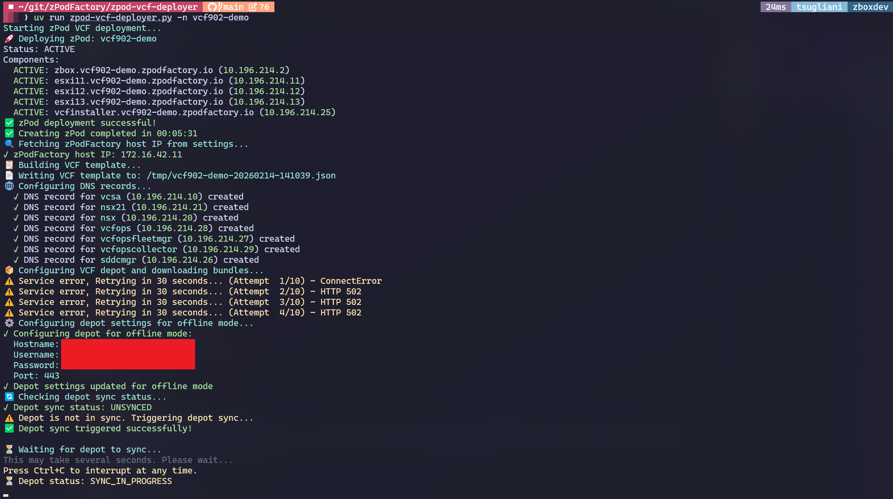
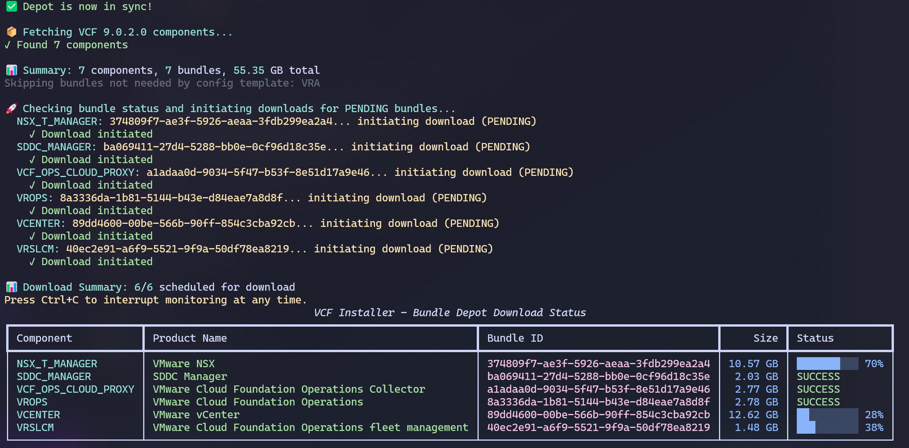
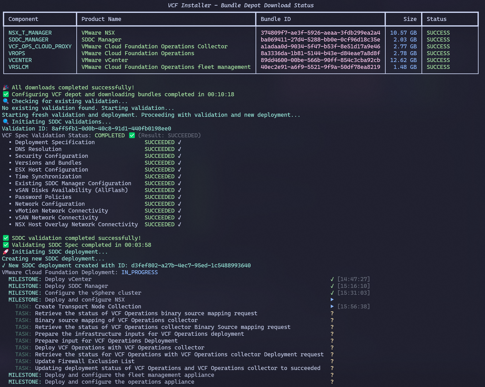
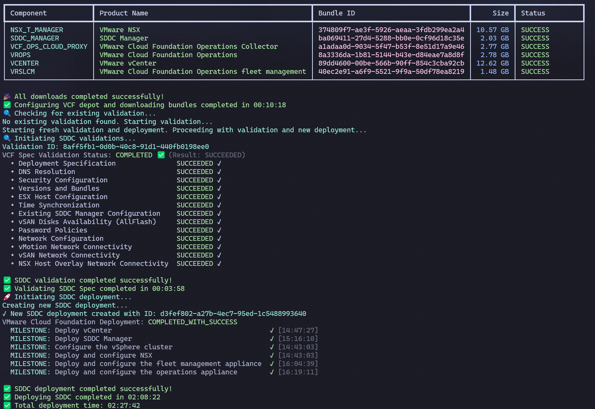

# VCF deployer

[zpod-vcf-deployer](https://github.com/zPodFactory/zpod-vcf-deployer) is a community automation tool that deploys **VMware Cloud Foundation (VCF)** end-to-end on infrastructure provisioned by zPodFactory.

## zPodFactory vs platform-specific automation

zPodFactory is the framework for deploying nested environments with the most **vanilla** component layout possible, while still preparing the full **Layer 1 foundation** that complex platforms expect:

- DNS and NTP reachable from every host
- Carved VLAN subnets, static routes, and trunk segments via **`zcore`**
- Consistent passwords, SSH access, and network plumbing between physical endpoint and nested hosts

That foundation is what makes arbitrary nested labs workable — but some products ship their **own** installer and orchestration stack. **VCF** is a prime example: SDDC Manager and the VCF Installer drive a multi-hour, multi-phase Broadcom provisioning workflow (depot setup, bundle downloads, validation, SDDC deployment) that zPodFactory does not replace.

**zpod-vcf-deployer** sits on top of both layers (see also [Bring your own …](bring-your-own.md) for the general pattern):

1. **zPodFactory** — creates the zPod (core appliance, nested ESXi hosts, VCF Installer VM) from a matching [profile](../admin/index.md#manage-profiles).
2. **Official VCF automation** — runs the Broadcom provisioning process against that zPod (depot, bundles, SDDC spec validation, SDDC deploy).

You get repeatable VCF labs without hand-building DNS records, depot wiring, or installer steps for every run.

```
Physical endpoint (vCenter / NSX)
        │
        ▼
   zPodFactory ──► zPod (zcore, ESXi, vcfinstaller, …)
        │
        ▼
 zpod-vcf-deployer ──► VCF Installer / SDDC Manager ──► VCF SDDC
```

## What the deployer automates

The script is a single Python CLI (`zpod-vcf-deployer.py`, run via `uv`) that chains:

| Step | Description |
| --- | --- |
| **Provision zPod** | Creates the zPod through the zPod API and waits until it is active |
| **Render VCF config** | Fills a Jinja2-enabled JSON SDDC template with zPod variables (`{{zpod_name}}`, `{{zpod_domain}}`, `{{zpod_password}}`, …) |
| **Prepare ESXi** | VCF 9.1+ only — installs the nested vSAN ESA mock-HW VIB over SSH where required |
| **Configure DNS** | Adds records for vCenter, NSX, ESXi, SDDC Manager, and related VCF components |
| **VCF depot** | Configures online or offline depot on the VCF Installer |
| **Download bundles** | Pulls required VCF bundles (ESXi, vCenter, NSX, etc.) |
| **Validate SDDC** | Runs VCF validation on the SDDC spec with live status |
| **Deploy SDDC** | Executes SDDC deployment with milestone progress in the terminal |

Typical full runs are on the order of **~2½ hours**, depending on depot speed and physical cluster performance. The tool supports **`--verify-only`** to stop after validation and deploy later with a second run.

Both **VCF 9.0.x** and **VCF 9.1.x** are supported; version-specific behavior (DNS layout, depot components, ESXi prep) is inferred from the template’s top-level `version` field.

## Screenshots

### Deployment initialization

zPod provisioning and early pipeline steps with live terminal output.



### Offline depot and bundle downloads

Depot configuration on the VCF Installer and bundle download progress.



### SDDC deployment progress

Global milestones and task status during SDDC deployment.



### Deployment complete

Successful completion summary with per-step timings.



## Screencast

Full terminal recording of an end-to-end run (zPod provision through SDDC deploy). Press **play** in the player below, or [open on asciinema.org](https://asciinema.org/a/xRhaXddDXgdSCkt3).

<div class="asciinema-embed" data-asciinema-id="xRhaXddDXgdSCkt3" markdown="0"></div>

!!! info "VCF 9.1+ depot mode"
    VCF **9.1 and later** require an **offline depot** — Broadcom’s new activation model replaces the online depot used on 9.0.x. The deployer rejects `--depot-mode online` when a 9.1+ template is selected. See the project README for offline depot setup ([doc-vcf-offlinedepot](https://github.com/tsugliani/doc-vcf-offlinedepot)).

## Profiles and templates

VCF deployments need a **zPodFactory profile** aligned with the **VCF JSON template** (host count, ESXi version, `vcfinstaller` component). Example profile shape:

- **`zcore-*`** — core appliance (DNS, routing, NFS); legacy profiles may still use `zbox-*`
- **`esxi-*`** — one or more nested ESXi hosts (CPU, memory, vNICs, vDisks per host)
- **`vcfinstaller-*`** — VCF Installer / SDDC Manager appliance

Shipped templates under `config/` in the repository cover common 3- and 4-host layouts for VCF 9.0.0.0 through 9.1.x (GA-pinned and `-latest` variants). GA templates pin full build-qualified component versions from the depot; `-latest` templates omit per-component versions so the installer picks the newest available (9.1+ only for express patches at bring-up).

Configure defaults once in `.env` (API URL, token, endpoint, profile, template path, depot settings), then deploy with:

```bash
uv run zpod-vcf-deployer.py -n my-vcf-lab
```

## Prerequisites

- [uv](https://docs.astral.sh/uv/) on a workstation with API access to zPodFactory
- zPodFactory instance with components enabled for your VCF profile (ESXi, `vcfinstaller`, etc.)
- [Broadcom download token](../admin/broadcom-download-token.md) for **online** depot (VCF 9.0.x), or an **offline VCF depot** server for 9.1+
- Matching **profile** and **template** for your target VCF release and host count

Dependencies are declared inline (PEP 723); `uv run` installs them automatically — no manual virtualenv.

## Related documentation

- **Repository (full usage, env vars, CLI reference):** [github.com/zPodFactory/zpod-vcf-deployer](https://github.com/zPodFactory/zpod-vcf-deployer)
- [Config scripts](config-scripts.md) — in-engine hooks for zPod/component lifecycle (complementary, not a substitute for VCF Installer automation)
- [Manage profiles](../admin/index.md#manage-profiles) — how zPodFactory profiles define the L1 stack
- [Broadcom download token](../admin/broadcom-download-token.md) — online depot token for VCF 9.0.x
