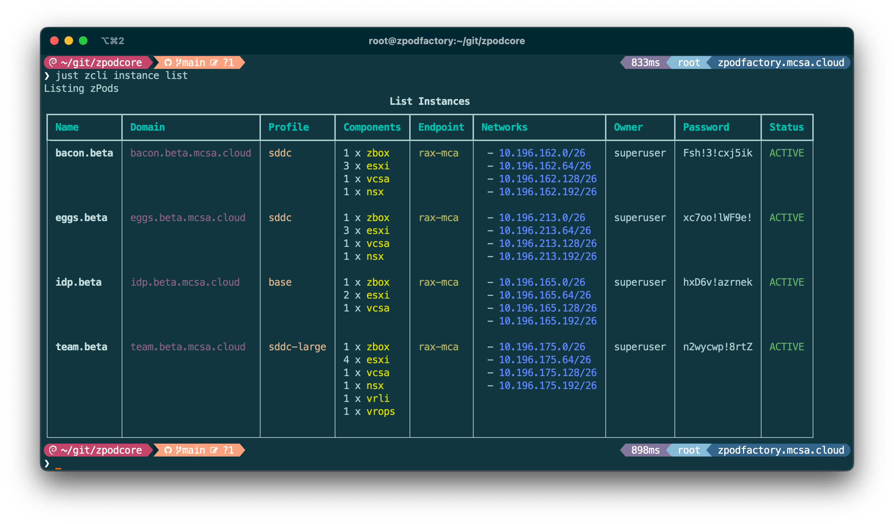
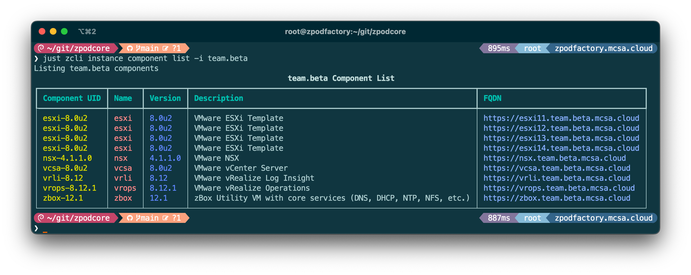

# User Guide

Once the zPodFactory framework is deployed and running, and has been configured by an Administrator you can start using the CLI to deploy nested environments.

## Introduction

`zcli` is a command line tool that allows you to manage your zPods and the whole zPodFactory framework.

## CLI Installation

Using `pip`:

``` { data-copy="pip install zcli" }
❯ pip install zcli
```

Verify that the CLI is now available and working:


## Authentication

The first thing you need to do is to connect to the zPodFactory API with the token an Administrator provided you.

``` {data-copy="zcli connect -s https://manager.zpodfactory.domain -t XXXX-TOKEN-XXXX"}
❯ zcli connect -s https://manager.zpodfactory.domain -t "XXXX-TOKEN-XXXX"
```

Verify that the connection was successfull and that you are connected to the API:

``` {data-copy="zcli user list"}
❯ zcli user list
```


## Manage zPods

zPods are known as a `Instance` in the zPodFactory framework.

### List zPods

``` {data-copy="zcli instance list"}
❯ zcli instance list
```



### Create zPods

To create a zPod you will need to provide a few parameters:

- `name`: The name of the zPod
- `profile`: The profile to use to deploy the zPod (use `zcli profile list` to list available profiles)
- `endpoint`: The endpoint to use to deploy the zPod (use `zcli endpoint list` to list available endpoints)

``` {data-copy="zcli instance create -n name -p profile -e endpoint"}
❯ zcli instance create -n name -p profile -e endpoint
```

For example:

``` {data-copy="zcli instance create -n test -p base -e sddc-lab"}
❯ zcli instance create -n test -p base -e sddc-lab
```

This will create a zPod with the following attributes:

- `name`: `test` This will be the name of the zPod, that also means it will concatenate this name with the `zpodfactory.domain` to create the FQDN of the zPod. In this case it will be `test.zpodfactory.domain`, and any component, such as `zbox` component will be `zbox.test.zpodfactory.domain`.

!!! info
    The `zpodfactory.domain` is a setting that can ONLY be configured by an Administrator.
    Check [Manage settings](../admin/index.md#manage-settings) for more information.

- `profile`: `base` This is the profile that will be used to deploy the zPod. It will be used to deploy the `zbox` component, and any other component that is required by the profile. The `base` profile actually entitles to the following components in our current configuration :

    - `zbox-12.1` (mandatory `component` to manage DNS/DHCP, 3 additional zPod /26 subnets on VLAN 64/128/192, and also the NFS datastore for the nested hosts)
    - `esxi-8.0u2` (Host Id: 11, CPU: 4, Mem: 48GB)
    - `esxi-8.0u2` (Host Id: 12, CPU: 4, Mem: 48GB)
    - `vcsa-8.0u2`

!!! info
    The `base` profile is a profile that can ONLY be configured by an Administrator.
    Check [Manage profiles](../admin/index.md#manage-profiles) for more information.

- `endpoint`: `sddc-lab` will reference the endpoint to use to deploy the zPod. In this case it will be the `sddc-lab` endpoint that is configured by an Administrator, and should link to the physical environment that will host this zPod nested environment.

!!! info
    The `sddc-lab` endpoint is an endpoint that can ONLY be configured by an Administrator.
    Check [Manage endpoints](../admin/index.md#manage-endpoints) for more information.


### Accessing the zPod

Once the zPod is deployed, you can access it using the following credentials

for vcsa (VMware vCenter Server):

- `username`: `administrator@name.zpodfactory.domain` (This can be fetched using the `zcli instance list` command)
- `password`: Each Instance/zPod has its password generated.  Password can be fetched by using the `zcli instance list` command)

For every other component, the username is the default for that component.  For example, on many VMware products the default administrator account is either `root` or `admin`, such as `nsx-v`, `nsx-t`, `nsx`, `vcda`, `vrops`, `vrli`.  However, for `vcd`, the default administrator account is `administrator`.  The password is always the Instance/zPod Password.


### Delete zPods

``` {data-copy="zcli instance delete -n name"}
❯ zcli instance delete -n name
```

!!! warning
    This will delete the zPod and all its components without confirmation, and will not be recoverable.


## Manage components

In the previous section we deployed a zPod with the `base` profile, which does not contain many products, but only the bare minimum to have a functional nested environment.
Here we will show you how to list the available components, and add a new component to a deployed/available zPod.

### List components

``` {data-copy="zcli component list"}
❯ zcli component list
```


### List component of an instance/zPod

You will need to provide the instance name parameter so that the CLI knows which instance/zPod to list the components from.

``` {data-copy="zcli instance component list -i instance_name"}
❯ zcli instance component list -i instance_name
```



### Add components to an Instance/zPod

If you want to add a new component to an instance, you will need to provide the component_uid.  component_uid is a combination of a product name and a version, as many products/versions exist for a given component.

``` {data-copy="zcli instance component add -i instance_name -c component_uid"}
❯ zcli instance component add -i instance_name -c component_uid
```

For example in our case:

``` {data-copy="zcli instance component add -i team.beta -c vcd-10.5}
❯ zcli instance component add -i team.beta -c vcd-10.5
```

This will add the `vcd-10.5` component to the `team.beta` instance/zPod.
