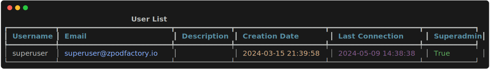
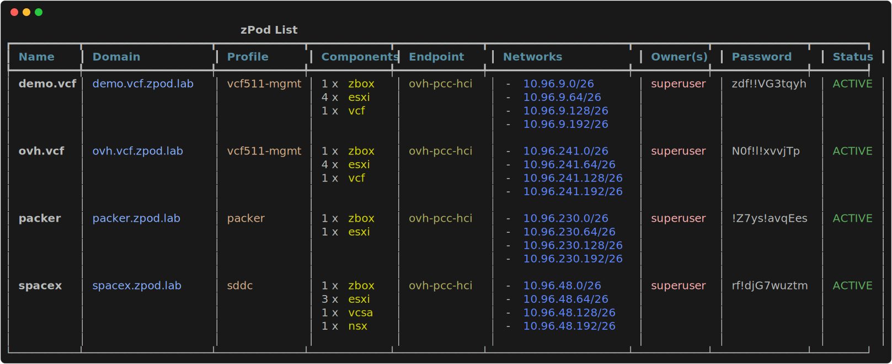
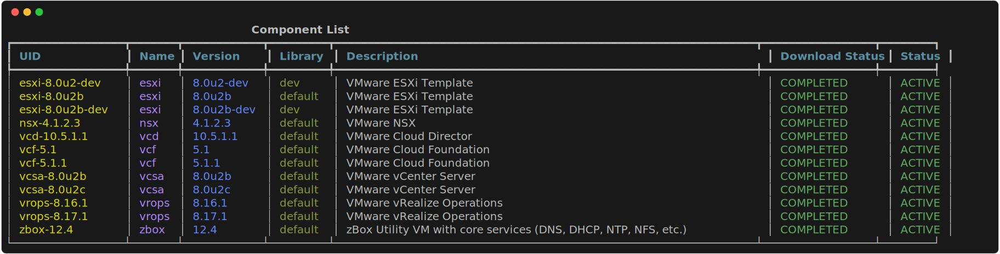
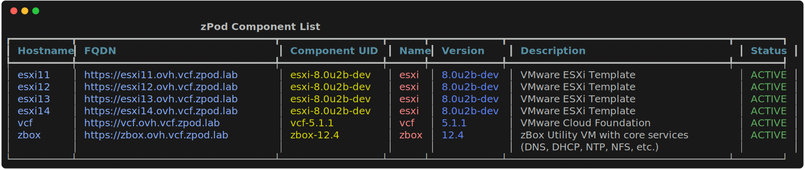
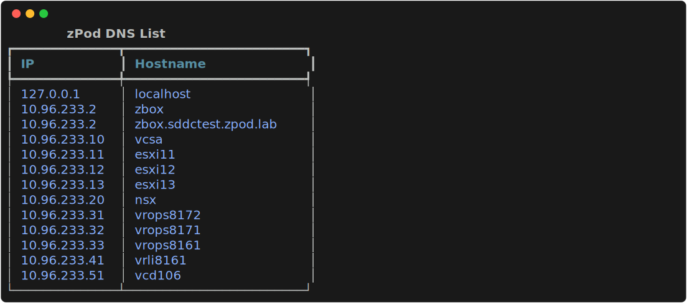

# User Guide

Once the zPodFactory framework is deployed and running, and has been configured by an Administrator you can start using the CLI to deploy nested environments.

## Introduction

`zcli` is a command line tool that allows you to manage your zPods and the whole zPodFactory framework.

## CLI Installation

Using `pip`:

``` { data-copy="pip install zpodcli" }
❯ pip install zpodcli
```

Verify that the CLI is now available and working:

``` { data-copy="zcli"}
❯ zcli

 Usage: zcli [OPTIONS] COMMAND [ARGS]...

╭─ Options ───────────────────────────────────────────────────────────────────╮
│ --factory             -f      TEXT  Use specific factory for this commmand. │
│ --output-svg                        Output an SVG file for any list command.│
│ --version             -V            Display version information.            │
│ --install-completion                Install completion for this shell.      │
│ --help                              Show this message and exit.             │
╰─────────────────────────────────────────────────────────────────────────────╯
╭─ Commands ──────────────────────────────────────────────────────────────────╮
│ component                          Manage Components                        │
│ endpoint                           Manage Endpoints                         │
│ enet                               Manage ENets                             │
│ factory                            Manage Factories                         │
│ group                              Manage Permission Groups                 │
│ library                            Manage Libraries                         │
│ profile                            Manage Profiles                          │
│ setting                            Manage Settings                          │
│ user                               Manage Users                             │
│ zpod                               Manage zPods                             │
╰─────────────────────────────────────────────────────────────────────────────╯
```

## Authentication

The first thing you need to do is to connect to the zPodFactory API with the token an Administrator provided you.

``` {data-copy="zcli factory add myfactory -s http://zpodfactory.domain.lab:8000 -t TOKEN -a}
❯ zcli factory add myfactory -s http://zpodfactory.domain.lab:8000 -t "TOKEN" -a
```

Verify that the connection was successfull and that you are connected to the API:

``` {data-copy="zcli user list"}
❯ zcli user list
```



## Manage zPods

zPods are the nested environments name in the zPodFactory framework.

### List zPods

``` {data-copy="zcli zpod list"}
❯ zcli zpod list
```



### Create zPods

To create a zPod you will need to provide a few parameters:

- `name`: The name of the zPod
- `profile`: The profile to use to deploy the zPod (use `zcli profile list` to list available profiles)
- `endpoint`: The endpoint to use to deploy the zPod (use `zcli endpoint list` to list available endpoints)

``` {data-copy="zcli zpod create name -p profile -e endpoint"}
❯ zcli zpod create name -p profile -e endpoint
```

For example:

``` {data-copy="zcli zpod create test -p base -e sddc-lab"}
❯ zcli zpod create test -p base -e sddc-lab
```

This will create a zPod with the following attributes:

- `name`: `test` This will be the name of the zPod, that also means it will concatenate this name with the `zpodfactory.domain` to create the FQDN of the zPod. In this case it will be `test.zpodfactory.domain`, and any component, such as `zbox` component will be `zbox.test.zpodfactory.domain`.

!!! info
    The `zpodfactory.domain` is a setting that can ONLY be configured by an Administrator.

    It is configured by the `zpodfactory_default_domain` setting. This setting should be configured at initial setup of this framework and **SHOULD NEVER BE MODIFIED**.

    Check [Manage settings](../admin/index.md#manage-settings) for more information.

- `profile`: `base` This is the profile that will be used to deploy the zPod. It will be used to deploy the `zbox` component, and any other component that is required by the profile. The `base` profile actually entitles to the following components in our current configuration :

    - `zbox-12.4` (mandatory `component` to manage DNS/DHCP, 3 additional zPod /26 subnets on tagged VLAN 64/128/192, and also the NFS datastore for the nested hosts)
    - `esxi-8.0u2` (Host Id: 11, CPU: 4, Mem: 48GB)
    - `esxi-8.0u2` (Host Id: 12, CPU: 4, Mem: 48GB)
    - `vcsa-8.0u2`

!!! info
    The `base` profile is a profile that can ONLY be configured by an Administrator.
    Check [Manage profiles](../admin/index.md#manage-profiles) for more information.

- `endpoint`: `sddc-lab` will reference the endpoint to use to deploy the zPod. In this case it will be the `sddc-lab` endpoint that is configured by an Administrator, and should link to the physical environment that will host this zPod nested environment.

!!! info
    The `sddc-lab` endpoint is an endpoint that can ONLY be configured by an Administrator.
    Check [Manage endpoints](../admin/index.md#manage-endpoints) for more information.


### Accessing the zPod

Once the zPod is deployed, you can access it using the following credentials

for vcsa (VMware vCenter Server):

- `username`: `administrator@name.zpodfactory.domain`
- `password`: Each zPod has its password generated.  Password can be fetched by using the `zcli zpod list` command)

For every other component, the username is the default for that component.  For example, on many VMware products the default administrator account is either `root` or `admin`, such as `nsx-v`, `nsx-t`, `nsx`, `vcda`, `vrops`, `vrli`.  However, for `vcd`, the default administrator account is `administrator`.  The password is **always** the zPod Password.


### Destroy zPods

``` {data-copy="zcli zpod destroy delete name"}
❯ zcli zpod destroy name
```

!!! warning
    This will destroy the zPod and all its components without confirmation, and will not be recoverable.


## Manage components

In the previous section we deployed a zPod with the `base` profile, which does not contain many products, but only the bare minimum to have a functional nested environment.
Here we will show you how to list the available components, and add a new component to a deployed/available zPod.

### List components

``` {data-copy="zcli component list"}
❯ zcli component list
```




### List components of a zPod

You will need to provide the zpod name parameter so that the CLI knows which zPod to list the components from.

``` {data-copy="zcli zpod component list zpod_name"}
❯ zcli zpod component list zpod_name
```



### Add components to a zPod

If you want to add a new component to a zpod, you will need to provide the `component_uid`.  Component UID is a combination of a product name and a version, as many versions can exist for a given product. (use `zcli component list` to list available components)

``` {data-copy="zcli zpod component add zpod_name -c component_uid"}
❯ zcli zpod component add zpod_name -c component_uid
```

For example in our case:

``` {data-copy="zcli zpod component add team.beta -c vcd-10.5}
❯ zcli zpod component add team.beta -c vcd-10.5
```

This will add the `vcd-10.5` component to the `team.beta` zPod.


## Manage DNS records

Since version 0.7.2, it is now possible to manage  DNS records dynamically through the CLI  to a zPod.  This is useful when you want to add/update/remove a DNS record to a zPod that is not managed by the default `zbox` component.

This will require the new `zbox-12.5` component to be part of the deployment profile.

### List DNS records to a zPod

List DNS records to a zPod that is not managed by the default `zbox` component.

``` {data-copy="zcli zpod dns list zpod_name"}
❯ zcli zpod dns list zpod_name
```




### Add DNS record to a zPod


Adding a DNS record to a zPod is useful when you want to add a DNS record to a zPod that is not managed by the default `zbox` component.

You can use 2 different ways to achieve this:

Using `--host-id` which allows you to set the host id on the management network of a zPod.


``` {data-copy="zcli zpod dns add zpod_name --hostname samplename --host-id 11"}
❯ zcli zpod dns add zpod_name --hostname samplename --host-id 11
```
in this case if your zpod management network was for example 192.168.10.0/26, the IP address of the DNS record will be `192.168.10.11`

`host-id` is the host id on the management network of a zPod. This is explicitely used for `profiles` so we can easily set specific `components` configuration that will be deployed on the zpod management subnet and just have to make sure the `host-id` is set correctly/unique per `profile`.


Example base profile (esxi11 and esxi12 have host_id 11 and 12 respectively):

```json
[
  {
    "component_uid": "zbox-12.5"
  },
  [
    {
      "component_uid": "esxi-8.0u2b",
      "host_id": 11,
      "hostname": "esxi11",
      "vcpu": 6,
      "vmem": 48
    },
    {
      "component_uid": "esxi-8.0u2b",
      "host_id": 12,
      "hostname": "esxi12",
      "vcpu": 6,
      "vmem": 48
    }
  ],
  {
    "component_uid": "vcsa-8.0u2b"
  }
]
```


This will result into the zpod deploying with `podname` as it's name and `zpodfactory.domain` set as the **zpodfactory_default_domain** with the following components in it:

- 1 x `zbox-12.5` component
- 2 x `esxi-8.0u2b` components with `host_id` 11 and 12 respectively
- 1 x `vcsa-8.0u2b` component


From a DNS perspective you will have the following DNS records:

```
zbox.podname.zpodfactory.domain -> 10.10.11.2
esxi11.podname.zpodfactory.domain -> 10.10.11.11
esxi12.podname.zpodfactory.domain -> 10.10.11.12
vcsa.podname.zpodfactory.domain -> 10.10.11.10
```

Using `--ip` which allows you to set any IP.

``` {data-copy="zcli zpod dns add zpod_name --hostname samplename --ip 10.10.10.11"}
❯ zcli zpod dns add zpod_name --hostname samplename --ip 10.10.10.11
```

As you can imagine setting any ip, allows you to setup hostnames for any IP address, which can be useful for any use cases leveraging other network subnets (like any overlay network managed by NSX that might be routed within the zPod, etc)

### Remove DNS record from a zPod

Remove a DNS record can be done using the below command line:

``` {data-copy="zcli zpod dns remove zpod_name --hostname samplename --ip 10.10.10.11"}
❯ zcli zpod dns remove zpod_name --hostname samplename --ip 10.10.10.11
```

!!! warning
    You are responsible for any DNS record change, as deleting one of the core components **WILL** completely break the zPod.