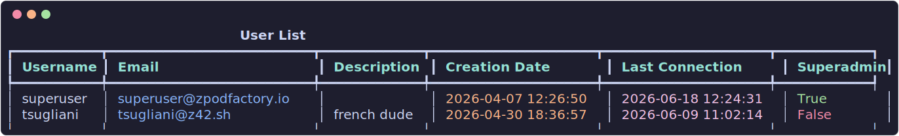
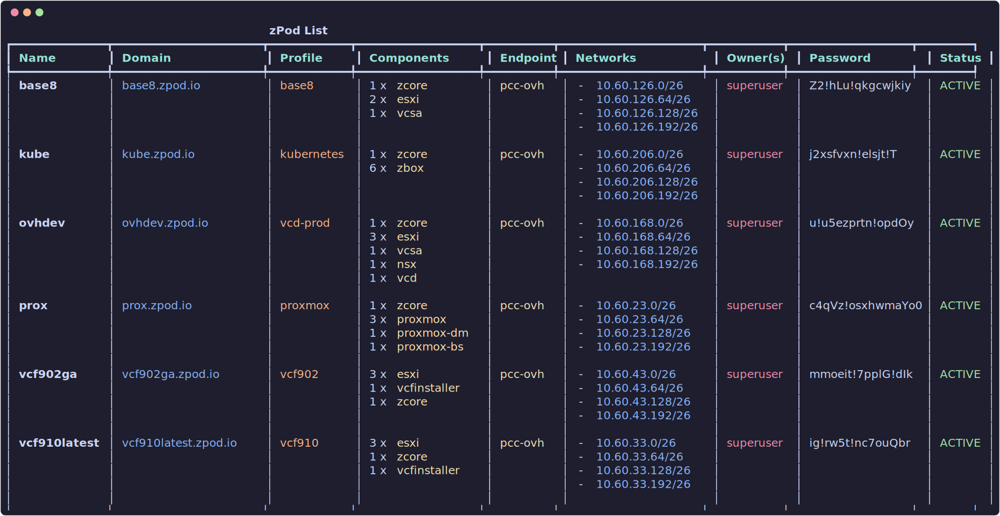
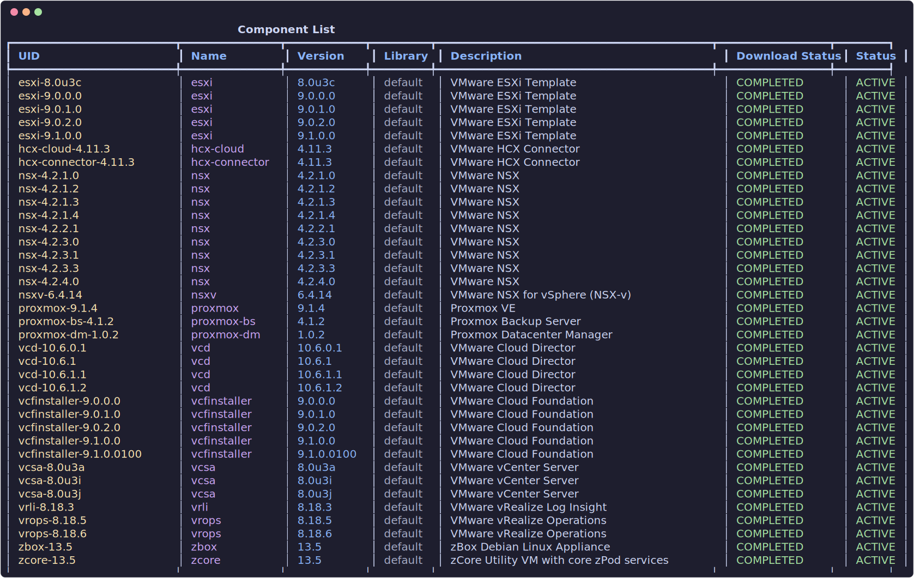
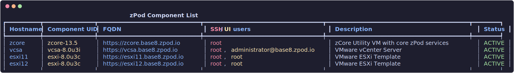
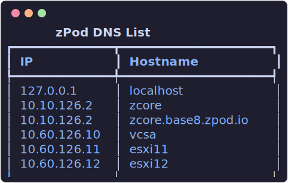

# User Guide

Once zPodFactory is deployed and configured by an administrator, you can manage nested environments through the **[zpodweb Web UI](web-ui.md)** (recommended — included with the appliance at `http://<appliance-ip>:8500`) or the **zcli** command line (automation and scripting).

## Web UI (recommended)

For most day-to-day tasks — creating zPods, browsing components, viewing network topology — use [zpodweb](web-ui.md), the official web interface deployed automatically with the zPodFactory appliance.

## CLI

The sections below document **zcli** workflows for users who prefer the terminal or need JSON output for automation.

## Introduction

`zcli` is a command line tool that allows you to manage your zPods and the whole zPodFactory framework.

## CLI Installation

Using `pip`:

``` { data-copy="pip install zpodcli" }
❯ pip install zpodcli
```

Verify that the CLI is now available and working:

``` { data-copy="zcli"}
❯ zcli

 Usage: zcli [OPTIONS] COMMAND [ARGS]...

╭─ Options ───────────────────────────────────────────────────────────────────╮
│ --factory             -f      TEXT  Use specific factory for this commmand. │
│ --output-svg                        Output an SVG file for any list command.│
│ --version             -V            Display version information.            │
│ --install-completion                Install completion for this shell.      │
│ --help                              Show this message and exit.             │
╰─────────────────────────────────────────────────────────────────────────────╯
╭─ Commands ──────────────────────────────────────────────────────────────────╮
│ component                          Manage Components                        │
│ endpoint                           Manage Endpoints                         │
│ enet                               Manage ENets                             │
│ factory                            Manage Factories                         │
│ group                              Manage Permission Groups                 │
│ library                            Manage Libraries                         │
│ profile                            Manage Profiles                          │
│ setting                            Manage Settings                          │
│ user                               Manage Users                             │
│ zpod                               Manage zPods                             │
╰─────────────────────────────────────────────────────────────────────────────╯
```

## Authentication

The first thing you need to do is to connect to the zPodFactory API with the token an Administrator provided you.

``` {data-copy="zcli factory add myfactory -s http://zpodfactory.domain.lab:8000 -t TOKEN -a}
❯ zcli factory add myfactory -s http://zpodfactory.domain.lab:8000 -t "TOKEN" -a
```

Verify that the connection was successfull and that you are connected to the API:

``` {data-copy="zcli user list"}
❯ zcli user list
```



## Manage zPods

zPods are the nested environments name in the zPodFactory framework.

### List zPods

``` {data-copy="zcli zpod list"}
❯ zcli zpod list
```



### Create zPods

To create a zPod you will need to provide a few parameters:

- `name`: The name of the zPod (must start with a letter; emoji characters are rejected). Non-superadmin users may be required to prefix names with their username when `ff_restrict_zpod_with_username_prefix` is enabled.
- `profile`: The profile to use (use `zcli profile list`). If `ff_zpod_default_profile` is set, `--profile` can be omitted.
- `endpoint`: The endpoint to deploy onto (use `zcli endpoint list`). If only one endpoint exists, it is selected automatically.

Additional options:

```bash
zcli zpod create <name> -p <profile> -e <endpoint> \
  --description "My lab" \
  --domain custom.domain.lab \   # optional domain override
  --enet <enet_name> \           # optional ENET override
  --wait                         # wait until deploy completes
```

``` {data-copy="zcli zpod create name -p profile -e endpoint"}
❯ zcli zpod create name -p profile -e endpoint
```

For example:

``` {data-copy="zcli zpod create test -p base -e sddc-lab"}
❯ zcli zpod create test -p base -e sddc-lab
```

This will create a zPod with the following attributes:

- `name`: `test` — concatenated with `zpodfactory_default_domain` for the zPod FQDN (`test.zpodfactory.domain`). The core appliance is at `zcore.test.zpodfactory.domain`.

!!! info
    The base domain is configured by the `zpodfactory_default_domain` setting and **should not be changed** after initial setup.
    Check [Manage settings](../admin/index.md#manage-settings) for more information.

- `profile`: `base` — deploys the components defined in that profile. A typical `base` profile includes:

    - `zcore-13.5` (mandatory core: DNS/DHCP, NFS, guest VLAN routing)
    - `esxi-8.0u3i` (Host Id: 11, CPU: 4, Mem: 48GB)
    - `esxi-8.0u3i` (Host Id: 12, CPU: 4, Mem: 48GB)
    - `vcsa-8.0u3i`

!!! info
    The `base` profile is a profile that can ONLY be configured by an Administrator.
    Check [Manage profiles](../admin/index.md#manage-profiles) for more information.

- `endpoint`: `sddc-lab` will reference the endpoint to use to deploy the zPod. In this case it will be the `sddc-lab` endpoint that is configured by an Administrator, and should link to the physical environment that will host this zPod nested environment.

!!! info
    The `sddc-lab` endpoint is an endpoint that can ONLY be configured by an Administrator.
    Check [Manage endpoints](../admin/index.md#manage-endpoints) for more information.


### Accessing the zPod

Once deployed, inspect connection details with:

``` {data-copy="zcli zpod info test"}
❯ zcli zpod info test
```

This shows networking, component URLs, credentials, and Proxmox UI links where applicable. Use `-j` for JSON or `-f bnc` to filter panels (Basic, Networking, Components).

For vCenter:

- `username`: `administrator@name.zpodfactory.domain`
- `password`: Each zPod has a generated password — fetch it from `zcli zpod list` or `zcli zpod info`.

For other components, use the default administrator account for that product (`root`, `admin`, etc.; `administrator` for VCD). The password is **always** the zPod password.


### Destroy zPods

``` {data-copy="zcli zpod destroy delete name"}
❯ zcli zpod destroy name
```

!!! warning
    This will destroy the zPod and all its components without confirmation, and will not be recoverable.


## Manage components

In the previous section we deployed a zPod with the `base` profile, which does not contain many products, but only the bare minimum to have a functional nested environment.
Here we will show you how to list the available components, and add a new component to a deployed/available zPod.

### List components

``` {data-copy="zcli component list"}
❯ zcli component list
```




### List components of a zPod

You will need to provide the zpod name parameter so that the CLI knows which zPod to list the components from.

``` {data-copy="zcli zpod component list zpod_name"}
❯ zcli zpod component list zpod_name
```



### Add components to a zPod

Provide the `component_uid` (use `zcli component list`). Optional overrides match [profile](../admin/index.md#manage-profiles) fields — useful for ESXi hosts that need custom sizing:

| Flag | Type | Example |
| --- | --- | --- |
| `--host-id` | integer | `13` |
| `--hostname` | string | `esxi13` |
| `--vcpu`, `--vmem` | integer | `16`, `128` |
| `--vnics` | integer | `4` (vNIC **count**, not a JSON object) |
| `--vdisks` | integer (repeatable) | `--vdisks 40 --vdisks 800` → disks of 40 GB and 800 GB |

Example aligned with a VCF-style profile entry (see `zcli profile info vcf-902-3hosts`):

```bash
zcli zpod component add <zpod_name> -c esxi-9.0.2.0 \
  --host-id 13 --hostname esxi13 \
  --vcpu 16 --vmem 128 \
  --vnics 4 \
  --vdisks 40 --vdisks 800
```

In profile JSON the same host would look like:

```json
{
  "component_uid": "esxi-9.0.2.0",
  "host_id": 13,
  "hostname": "esxi13",
  "vcpu": 16,
  "vmem": 128,
  "vnics": 4,
  "vdisks": [40, 800]
}
```

Example:

``` {data-copy="zcli zpod component add team.beta -c vcd-10.6.1"}
❯ zcli zpod component add team.beta -c vcd-10.6.1
```

Supported component families include VMware products (vSphere, NSX, VCF, HCX, etc.) and **Proxmox** (`proxmox`, `proxmox-dm`, `proxmox-bs`).


## Manage DNS records

Since version 0.7.2, DNS records can be managed dynamically through the CLI. This requires a `zcore-*` (or legacy `zbox-*`) core component in the deployment profile.

!!! warning
    **Do not change DNS records for zPodFactory-managed components.** Hostnames such as `zcore`, `esxi11`, `vcsa`, `nsx`, and others created by deploy or `zpod component add` are owned by the platform. Deployments, config scripts, certificate flows, and component lifecycle all assume those names and IPs stay in sync. Updating, re-pointing, or removing them — via `zcli zpod dns`, the API, or manual edits on the core VM — can break connectivity for the entire zPod and is difficult to recover from cleanly.

    Use DNS management only for **extra** names you add yourself (overlays, guest subnets, demos, external endpoints). Leave platform records alone.

### List DNS records to a zPod

List DNS records for a zPod (managed via the core appliance's DNS API):

``` {data-copy="zcli zpod dns list zpod_name"}
❯ zcli zpod dns list zpod_name
```




### Add DNS record to a zPod


Adding a DNS record is useful for hostnames on overlay networks or other subnets not auto-managed by component deploy:

You can use 2 different ways to achieve this:

Using `--host-id` which allows you to set the host id on the management network of a zPod.


``` {data-copy="zcli zpod dns add zpod_name --hostname samplename --host-id 11"}
❯ zcli zpod dns add zpod_name --hostname samplename --host-id 11
```
in this case if your zpod management network was for example 192.168.10.0/26, the IP address of the DNS record will be `192.168.10.11`

`host-id` is the host id on the management network of a zPod. This is explicitely used for `profiles` so we can easily set specific `components` configuration that will be deployed on the zpod management subnet and just have to make sure the `host-id` is set correctly/unique per `profile`.


Example base profile:

```json
[
  {
    "component_uid": "zcore-13.5"
  },
  [
    {
      "component_uid": "esxi-8.0u3i",
      "host_id": 11,
      "hostname": "esxi11",
      "vcpu": 6,
      "vmem": 48
    },
    {
      "component_uid": "esxi-8.0u3i",
      "host_id": 12,
      "hostname": "esxi12",
      "vcpu": 6,
      "vmem": 48
    }
  ],
  {
    "component_uid": "vcsa-8.0u3i"
  }
]
```

Resulting DNS records for zPod `podname`:

```
zcore.podname.zpodfactory.domain -> 10.10.11.2
esxi11.podname.zpodfactory.domain -> 10.10.11.11
esxi12.podname.zpodfactory.domain -> 10.10.11.12
vcsa.podname.zpodfactory.domain -> 10.10.11.10
```

Using `--ip` which allows you to set any IP.

``` {data-copy="zcli zpod dns add zpod_name --hostname samplename --ip 10.10.10.11"}
❯ zcli zpod dns add zpod_name --hostname samplename --ip 10.10.10.11
```

As you can imagine setting any ip, allows you to setup hostnames for any IP address, which can be useful for any use cases leveraging other network subnets (like any overlay network managed by NSX that might be routed within the zPod, etc)

### Update DNS record on a zPod

``` {data-copy="zcli zpod dns update zpod_name --hostname samplename --ip 10.10.10.12"}
❯ zcli zpod dns update zpod_name --hostname samplename --ip 10.10.10.12
```

### Remove DNS record from a zPod

Remove a DNS record can be done using the below command line:

``` {data-copy="zcli zpod dns remove zpod_name --hostname samplename --ip 10.10.10.11"}
❯ zcli zpod dns remove zpod_name --hostname samplename --ip 10.10.10.11
```

!!! warning
    You are responsible for any DNS record change, as deleting one of the core components **WILL** completely break the zPod.