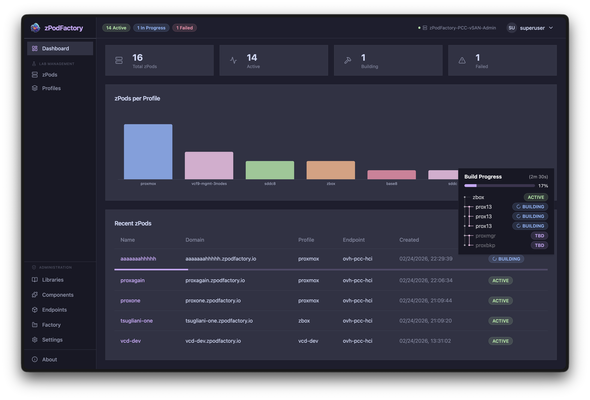
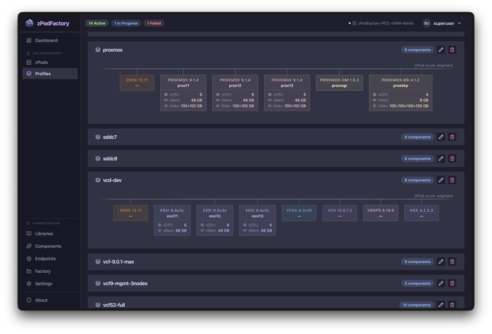

# Web UI (zpodweb)

[zpodweb](https://github.com/zPodFactory/zpodweb) is the official web interface for zPodFactory. It connects to the **zPod API** (`zpodapi`) and provides a visual way to manage zPods, endpoints, components, libraries, profiles, and factory settings — without using the CLI for day-to-day operations.

The UI uses a **Catppuccin Mocha** dark theme, responsive sidebar navigation, and an Nginx reverse proxy so the browser never talks directly to the API (no CORS issues).

## Included with the appliance

The [zPodFactory appliance](../install/index.md#using-the-zpodfactory-appliance-highly-recommended) deploys **zpodweb automatically** during first boot. The appliance install script:

1. Clones [zPodFactory/zpodweb](https://github.com/zPodFactory/zpodweb) into `~/git/zpodweb`
2. Pre-configures `.env` with the appliance API URL (`http://<appliance-ip>:8000`) and API token
3. Starts the zpodweb Docker Compose stack

Once the appliance finishes provisioning, open:

```
http://<appliance-ip>:8500
```

If a single target is configured, zpodweb **auto-connects** on page load — you land directly on the dashboard.

!!! info "Ports on the appliance"
    | Service | Default port | Purpose |
    | --- | --- | --- |
    | **zpodweb** | `8500` | Web UI |
    | **zPod API** | `8000` | REST API / OpenAPI docs at `/docs` |
    | **Prefect UI** | `8060` | Flow engine task monitoring |

## Screenshots

### Dashboard

Overview of zPod counts, status distribution, and recent activity charts.



### Profiles

Browse and inspect deployment profiles and their component definitions.



### Components

The **Components** page is the usual starting point for preparing OVA/ISO files before building profiles or zPods:

- **Browse** — search and filter the full library catalog (all, active, or in-progress downloads); sort by UID, name, version, or status
- **Enable** — triggers the same download engine as `zcli component enable`; VMware products use the factory's configured [Broadcom download token](../admin/broadcom-download-token.md)
- **Upload** — provide binaries manually when depot download is unavailable (equivalent to `zcli component upload`); checksum matching enables the correct component automatically
- **Progress** — live download percentage and status while components are fetched from the depot or verified after upload

Set `zpodfactory_broadcom_download_token` under **Settings** in the Web UI (or via CLI) before enabling Broadcom depot components such as NSX or vCenter OVAs.

## Features

| Area | What you can do |
| --- | --- |
| **Dashboard** | zPod counts, status distribution, activity charts |
| **zPods** | List, create, inspect, and destroy zPods with full detail views |
| **Network topology** | Visio-style interactive diagram — NSX T0/T1, trunk segments, zCore interfaces, deployed components |
| **Network table** | Auto-computed CIDR, gateway, DNS, VLAN ID, and router info per zPod network |
| **Endpoints** | View compute (vSphere) and network (NSX) configurations side by side |
| **Components** | Searchable, filterable component catalog; enable/disable with download progress; upload OVA/ISO via file picker; depot downloads via [Broadcom download token](../admin/broadcom-download-token.md) |
| **Libraries** | Manage libraries with enable/disable and resync |
| **Profiles** | View and edit deployment profiles |
| **Settings** | View and manage global factory settings |
| **Multi-target** | Connect to multiple zPodFactory instances; auto-connect when only one target is saved |

## First login

### On the appliance (pre-configured)

The appliance writes the superuser API token into zpodweb's `.env` during install. Browse to `http://<appliance-ip>:8500` — no manual token entry is required when defaults are applied correctly.

### Manual or remote access

If you deploy zpodweb yourself, or connect from a workstation to a remote zPodFactory instance:

1. Open the zpodweb login page
2. Enter the **API URL** (e.g. `http://zpodfactory.domain.lab:8000`)
3. Enter your **API token** (from an administrator, or from `~/.config/zcli/.zclirc` on the appliance)

Target configurations are stored in the browser's `localStorage`. With a single saved target, zpodweb auto-connects on the next visit.

## Manual deployment

For development or non-appliance installs, zpodweb runs as a Docker container:

```bash
git clone https://github.com/zPodFactory/zpodweb.git
cd zpodweb
cp .env.example .env
# Edit .env — set ZPODWEB_DEFAULT_ZPODFACTORY_API_URL and _API_TOKEN
docker compose up -d --build
```

Open `http://localhost:8500` (or the port set in `ZPODWEB_DEFAULT_UI_PORT`).

See the [zpodweb README](https://github.com/zPodFactory/zpodweb#production-deployment-docker) for development setup (`npm run dev`) and environment variables.

## Web UI vs CLI

Both interfaces talk to the same zPod API. Use whichever fits the task:

| Prefer **zpodweb** | Prefer **zcli** |
| --- | --- |
| Visual zPod/network topology overview | Scripting and automation (`-j` JSON output) |
| Browse, enable, and upload components (Broadcom depot or file picker) | Bulk operations in shell scripts |
| Browsing profiles and factory settings | CI/CD pipelines and `just` recipes |
| Quick create/destroy from the browser | Headless appliance administration |

The [User Guide](index.md) documents CLI workflows. Administrators should also see the [Admin Guide](../admin/index.md) for settings, permissions, and feature flags.

## Source repository

- GitHub: [https://github.com/zPodFactory/zpodweb](https://github.com/zPodFactory/zpodweb)
- Stack: React 19, TypeScript, Vite, Tailwind CSS, Radix UI, Zustand, Recharts
