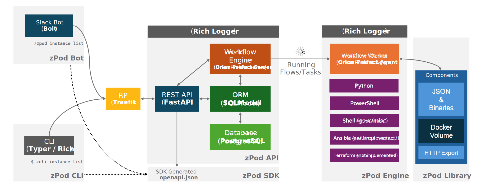

# Welcome to zPodFactory

Build your own VMware nested Clouds with zPodFactory !

## What is zPodFactory ?

zPodFactory is a framework/engine to deploy and manage VMware nested environments.

It's basically a rebuild from scratch of a previous project, that was focused on only one specific use case and had various parts that were hardcoded to one very peculiar environment.
Learning from those mistakes, zPodFactory has been redesigned to be more flexible and extensible, and to be able to adapt to different use cases, and mitigate all the administration hurdles that come with nested environments.

The focus has been targeting a few key aspects:

1. **Simplicity**: Deploy simply and quickly nested environments based on `profiles`, without having to constantly prepare, manage, operate the complexity of the underlying infrastructure. The end goal is to have a nice UX, and a simple CLI to deploy and manage the nested environments.
2. **Flexibility**: The framework focuses **ONLY** on the initial deployment of the nested environment. It does not try to manage the lifecycle of the nested environment. It's up to the user to decide how to manage the lifecycle of the nested environment. The framework is designed to be able to adapt to different use cases, and to be able to deploy different types of nested environments, so it's slightly opinionated but only for the core components required for a functional nested environment.
3. **Extensibility**: We have our own API to be able to extend the current capabilities easily in the future.
4. **Maintainability**: We have been focusing on key areas to improve as much as possible the basic administration and maintainance tasks.

## Project Architecture

zPodFactory is built upon the following various opensource projects:

The project is composed of the following sub-projects:

- **zPod API**: The zPod API is the core component of the project. It's the main entry point to interact with the project. It's a REST API that exposes the main functionalities of the project. It's the only component that is publicly exposed. It is the central component that controls and orchestrates everything in this framework. It will take care of any requests, manage and store information, and orchestrate/schedule flows onto the **zPod Engine** for execution.

- **zPod SDK**: The zPod SDK is generated from the [FastAPI](https://fastapi.tiangolo.com/) OpenAPI JSON schema. It's a Python SDK that allows clients to interact with the API without using pure REST API calls.
- **zPod CLI**: The zPod CLI is a wrapper around the zPod API which is used to manage, configure and operate everything required to run zPod instances. It is based on the [Typer](https://typer.tiangolo.com/) framework.
- **zPod Engine**: The zPod Engine is the core component responsible for the deployment of the nested environment. It uses the [Prefect](https://orion-docs.prefect.io/latest/) workflow orchestration engine to handle scheduling and execution all flows and their child tasks.
- **zPod Library**: This is a storage location that encompasses the [zPodLibrary](https://github.com/zPodFactory/zPodLibrary) component metadata and downloaded templates/binaries.  These files will be managed by the embedded download engine.

> Everything runs in Docker containers, through a Docker Compose application stack.

